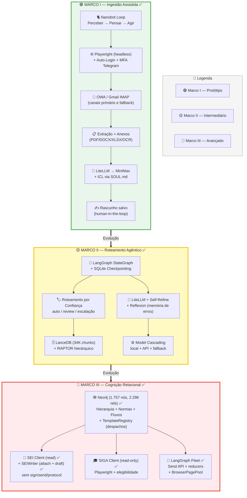
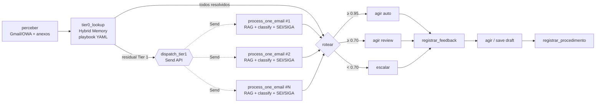
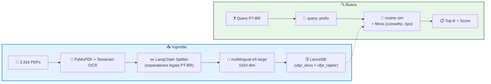

# Arquitetura — Sistema de Automação Burocrática UFPR

> **Status atual:** Marcos I, II, II.5, III ✅ completos. Marco IV (Estágios end-to-end) 🟡 em andamento — lógica pronta, bloqueado em captura de seletores Playwright para habilitar `SEI_WRITE_MODE=live`.
> Veja `TASKS.md` para o roadmap restante.

## Visão geral das 3 fases



## Stack por componente

| Componente | Tecnologia | Notas |
|---|---|---|
| **Linguagem** | Python ≥ 3.12 | |
| **Orquestrador** | LangGraph (Marco II+) / Nanobot loop (Marco I) | StateGraph + SQLite checkpointing |
| **LLM** | LiteLLM → MiniMax-M2 | Provider-agnostic. Cascading: local/Ollama → API → fallback |
| **Memória vetorial** | LanceDB + RAPTOR | 34.285 chunks, multilingual-e5-large (1024 dim), Google Drive |
| **Memória relacional** | Neo4j | 1.757 nós, 2.296 relações (órgãos, normas, fluxos, templates) |
| **Episódica** | ReflexionMemory | Análise + recall de erros passados |
| **Canal e-mail** | Gmail IMAP (primário) / Playwright OWA (fallback) | Auto-login + MFA via Telegram (OWA) |
| **Sistemas legados** | Playwright (SEI, SIGA) | Read-only por enquanto |
| **Anexos** | PyMuPDF, python-docx, openpyxl, Tesseract | OCR fallback para PDFs escaneados/imagens |
| **Scheduler** | APScheduler (3x/dia configurável) | `--schedule [--once]` |
| **Feedback UI** | Streamlit | Dashboard, revisão, estatísticas |

## Pipeline LangGraph (Marco II + III com Fleet)

Após Marco III, o pipeline default usa **fan-out via `Send` API**: cada email Tier 1 (não resolvido pelo playbook Tier 0) vira um sub-agent paralelo que faz `rag_retrieve + classificar + consultar_sei + consultar_siga` independentemente. Reducers `Annotated[..., _merge_dict]` em `graph/state.py` mesclam os dicts paralelos sem last-write-wins.



Topologia única: Fleet (fan-out via `Send` API paraleliza Tier 1). O AFlow topology evaluator (registry hand-authored + evaluator + CLI) foi removido em 2026-05-02 — nunca foi exercitado em produção e as 4 variantes não-`fleet` eram CLI-only ablation study sem função de avaliação implementada. Restauração via `git show <pre-removal>:ufpr_automation/aflow/`.

## RAG — Pipeline de ingestão e busca



**Cobertura:** 99,2% (3.288/3.316 PDFs, 70 recuperados via OCR). Detalhes em `RAG_INGESTION_REPORT.md`.

## GraphRAG (Marco III)

Grafo Neo4j construído via `seed.py` (conhecimento estruturado: hierarquia, fluxos, templates) e `enrich.py` (extração de normas do RAG vetorial via regex):

| Tipo de nó | Quantidade | Origem |
|---|---|---|
| Órgãos | 21 | seed (SOUL.md) |
| Pessoas | 12 | seed |
| Normas | ~1.600 | enrich (extraídas dos PDFs) |
| Fluxos | 6 (47 etapas) | seed |
| Templates | 15 | seed (ClaudeCowork) |
| Tipos de processo SEI | 20 | seed |
| Abas SIGA | 8 | seed |

**Vigência:** cada norma tem `status` (`vigente` 1.281 / `alterada` 174 / `revogada` 148). Relações `ALTERA`, `REVOGA`, `CONSOLIDADA_EM` formam a cadeia de linhagem. `fonte_rag` aponta para o PDF original no LanceDB.

**Templates de despacho** (Marco III): movidos de `sei/client.py` para o grafo. `_seed_templates` em `graphrag/seed.py` persiste `Template.conteudo` e `Template.despacho_tipo`. `graphrag/templates.py:TemplateRegistry` busca por tipo via Cypher com cache in-memory; é consumido por `sei/client.py:prepare_despacho_draft` e `sei/writer.py:save_despacho_draft`.

**Retrieval:** o nó `rag_retrieve` (ou `process_one_email` no Fleet) combina:
1. `RaptorRetriever.search()` — collapsed-tree vetorial
2. `GraphRetriever` — workflow + normas + templates + hints SIGA + contatos
3. `ReflexionMemory.retrieve()` — erros passados como contexto negativo

Ver `graphrag/README.md` para detalhes.

## Marco III — Componentes novos

### LangGraph Fleet (`graph/fleet.py`)

Sub-agents paralelos via `langgraph.types.Send`. `dispatch_tier1` é a conditional edge router após `tier0_lookup`: se todos os emails foram resolvidos pelo playbook, retorna `"rotear"`; caso contrário, retorna `[Send("process_one_email", SubState(email=e, ...)) for e in tier1_emails]`. Cada sub-agent executa o pipeline Tier 1 completo (RAG + classify + SEI/SIGA conditional) e retorna um partial state cujos dicts são mesclados pelos reducers `Annotated[..., _merge_dict]` em `graph/state.py`.

### BrowserPagePool (`graph/browser_pool.py`)

Pool assíncrono de pages Playwright derivadas de um único `BrowserContext` compartilhado. `acquire()` é um `asynccontextmanager` com `asyncio.Semaphore` (default size 3, configurável via `FLEET_BROWSER_POOL_SIZE`). **Status: parked** — `process_one_email` do Fleet é sync e LangGraph dispara sub-agents em thread pool, cada um com event loop próprio; `BrowserContext` do Playwright é bound ao loop criador, então o pool não é usável até o Fleet virar async. Produção hoje depende do reuso de `storage_state` em `sei/browser.py` / `siga/browser.py` (0 logins em steady state). Ver TASKS.md para o caminho de refactor.

### SEIWriter (`sei/writer.py`)

Camada de escrita controlada para SEI. **Public API expandida para `attach_document`, `save_despacho_draft` e `create_process`** (Marco IV adicionou o último). Não existem métodos `sign()`, `send()`, `protocol()` ou `finalize()` — a ausência arquitetural continua sendo o mecanismo principal de safety. Belt + suspenders:

1. **Whitelist do public API**: `test_writer_public_api_is_only_attach_and_draft` verifica a superfície pública.
2. **6 testes regressivos** verificam ausência de `sign`, `assinar`, `send`, `enviar`, `enviar_processo`, `protocol`, `protocolar`, `finalize`.
3. **Static scan** do código fonte por `.click('text=Assinar')`, `.click('text=Enviar')`, `.click('text=Protocolar')` em `test_no_method_body_references_forbidden_keywords`.
4. **`_FORBIDDEN_SELECTORS` runtime guard**: `_safe_click(selector)` valida cada clique contra a lista de tokens proibidos antes de executar; lança `PermissionError` se algum bater.
5. **Audit trail**: cada operação grava screenshot pré + DOM dump pós + entrada JSONL em `SEI_WRITE_ARTIFACTS_DIR/audit.jsonl` com sha256 do arquivo/conteúdo.

**Dry-run mode (Marco IV)**: o construtor aceita `dry_run: bool` (default vem de `settings.SEI_WRITE_MODE`, que por sua vez default é `"dry_run"`). Em dry-run as três operações capturam screenshots/audit + retornam `success=True, dry_run=True` sem clicar em NADA no SEI. `create_process` retorna um `processo_id` sintético `"DRYRUN-<run_id>"` para que downstream possa encadear `attach_document` e `save_despacho_draft`. O modo `live` ainda raise `NotImplementedError` nas três ops — os seletores Playwright precisam ser capturados contra um SEI real antes de flipar para live.

**`attach_document(processo_id, file_path, classification: SEIDocClassification)`** exige a classificação estruturada do documento, mirroring o formulário "Incluir Documento" do SEI:
```
tipo          → "Externo" (upload) | "Despacho" (gerado no editor)
subtipo       → "Termo" | "Relatório" (apenas Externo)
classificacao → "Inicial" | "Aditivo" | "Rescisão" | "Parcial" | "Final"
sigiloso      → True por default (LGPD)
motivo_sigilo → "Informação Pessoal" (Hipótese Legal)
data_documento → ISO (vazio = hoje)
```

**`save_despacho_draft(processo_id, tipo, variables, body_override=None)`** aceita `body_override` (Marco IV) para que o `agir_estagios` node passe direto o `despacho_template` do intent Tier 0 sem depender do lookup via `TemplateRegistry` (evita round-trip ao Neo4j quando o texto já está no playbook).

**`create_process(tipo_processo, especificacao, interessado, motivo="")`** inicia um processo SEI novo, preenchendo "Iniciar Processo" → Tipo do Processo → Especificação → Interessado → Nível de Acesso Restrito → Hipótese Legal Informação Pessoal → Salvar. A única ação permitida é Salvar — nunca tramita.

### Playbook estendido + checker registry (`procedures/`)

Marco IV estendeu o modelo `Intent` (`procedures/playbook.py:67`) com 5 campos opcionais que descrevem o workflow SEI de um intent:

| Campo | Tipo | Semântica |
|---|---|---|
| `sei_action` | `"none" \| "create_process" \| "append_to_existing"` | Decide se o `agir_estagios` cria processo novo, anexa em existente, ou só responde email |
| `sei_process_type` | `str` | Rótulo do "Tipo do Processo" no SEI (ex.: "Graduação/Ensino Técnico: Estágios não Obrigatórios") |
| `required_attachments` | `list[str]` | Rótulos semânticos exigidos; resolvidos via `SEI_DOC_CATALOG.yaml` para obter a classificação SEI |
| `blocking_checks` | `list[str]` | IDs de checkers registrados em `procedures/checkers.py` que validam pré-condições (matrícula ativa, reprovações, jornada, datas, etc.) |
| `despacho_template` | `str` | Corpo do Despacho a ser pasted no rich-text editor do SEI (separado do `template` que é o rascunho de email) |

Os 24 intents legados continuam funcionando sem mudança — os novos campos têm defaults inertes.

**`procedures/checkers.py`** implementa um registry de funções de check com decorator `@register("id")` e modelo tri-state `pass | soft_block | hard_block`. Um `CheckSummary` agrega resultados; `.can_proceed` é `True` só quando não há bloqueios; `.needs_justification` sinaliza quando há soft blocks mas não hard blocks (usado pelo `agir_estagios` para decidir entre "criar processo" ou "pedir justificativa formal ao aluno"). Checkers ausentes do SIGA/SEI context caem em soft_block com `"SIGA não consultado — requer verificação manual"` ao invés de falharem silenciosamente.

10 checkers registrados para o intent `estagio_nao_obrig_acuse_inicial` (post-2026-04-30, removidos `siga_ch_simultaneos_30h` e `siga_concedente_duplicada` — verificação de estágio ativo / duplicado é responsabilidade do SEI cascade via `sei_processo_vigente_duplicado`):

| Checker ID | Tipo | Condição |
|---|---|---|
| `siga_matricula_ativa` | HARD | Status ≠ ATIVA (trancada/cancelada/integralizada) |
| `siga_reprovacoes_ultimo_semestre` | SOFT | > 1 reprovação → exige justificativa formal |
| `siga_reprovacao_por_falta` | HARD | Reprovação por falta (regra específica DG) |
| `siga_curriculo_integralizado` | HARD | Currículo já integralizado (não pode estágio não-obrig.) |
| `data_inicio_retroativa` | HARD | Data de início < hoje (homologação retroativa não permitida) |
| `data_inicio_antecedencia_minima` | HARD | Antecedência < 2 dias úteis |
| `tce_jornada_sem_horario` | HARD | TCE não especifica horário da jornada |
| `tce_jornada_antes_meio_dia` | HARD | Jornada começa < 12h00. Exceções: aluno integralizado OU pendentes ⊆ {OD501 (Estágio Sup.), ODDA6 (TCC1), ODDA7 (TCC2)} |
| `sei_processo_vigente_duplicado` | HARD | Já existe processo SEI vigente do mesmo tipo para o aluno |
| `supervisor_formacao_compativel` | SOFT | Formação do supervisor não afim a Design → exigir Declaração de Experiência (form PROGRAD) |

### SEI_DOC_CATALOG (`workspace/SEI_DOC_CATALOG.yaml`)

Catálogo YAML que mapeia rótulos semânticos (usados em `required_attachments` no playbook) para a classificação SEI. Exemplo:

```yaml
TCE:
  sei_tipo: Externo
  sei_subtipo: Termo
  sei_classificacao: Inicial
  sigiloso: true
  motivo_sigilo: "Informação Pessoal"
  nota: "Plano de Atividades via de regra vem embutido no mesmo PDF; não é anexo separado."
```

6 rótulos catalogados: `TCE`, `Termo Aditivo`, `Termo de Rescisão`, `Relatório Parcial`, `Relatório Final`, `Ficha de Avaliação` (classificada como Relatório Final).

### Extração de variáveis do TCE anexado (`procedures/playbook.py:extract_variables`)

Marco IV estendeu `extract_variables` para consumir `email.attachments[*].extracted_text`. Novos regexes capturam do texto do TCE:

- `numero_tce` (agora também reconhece "Termo de Compromisso de Estágio Nº X", não só a sigla "TCE")
- `nome_concedente` (extraído de "Concedente: NOME" ou "Parte Concedente:")
- `data_inicio` / `data_fim` (preferência por padrão "Período DD/MM/YYYY a DD/MM/YYYY")
- `horas_diarias` / `horas_semanais` (padrões "N horas diárias" / "N horas semanais")
- `jornada_horario_inicio` (formato HH:MM extraído de "13h00 às 19h00")

O corpo do email continua tendo precedência sobre o texto do anexo — assim o aluno pode corrigir manualmente sem reenviar o PDF.

### TemplateRegistry (`graphrag/templates.py`)

Busca despachos do Neo4j com cache in-memory. Substitui as constantes hardcoded antes embutidas em `sei/client.py` (lines 20-79, removidas pelo Wave 1). Lazy import dentro de `prepare_despacho_draft` para evitar ciclo SEI ↔ GraphRAG. Fallback `campos_pendentes=["neo4j_unavailable"]` se Neo4j off.

### Classificação (`graph/nodes.py:_classify_with_litellm`)

Path único — DSPy foi removido na Onda 3 (2026-05-02). O gate `USE_DSPY` sempre caía no fallback LiteLLM porque `dspy_modules/optimized/gepa_optimized.json` nunca foi gerado (otimização requer 20+ feedback samples; corpus está vazio). Restauração via `git show <pre-removal>:ufpr_automation/dspy_modules/`.

`_classify_with_litellm` chama `LLMClient.classify_email_async` + `LLMClient.self_refine_async` (Self-Refine Madaan et al. NeurIPS 2023). Antes de validar via Pydantic `TypeAdapter`, o cliente normaliza o campo `categoria` via `core/models.py:normalize_categoria` (alias map curado de 100+ entradas).

