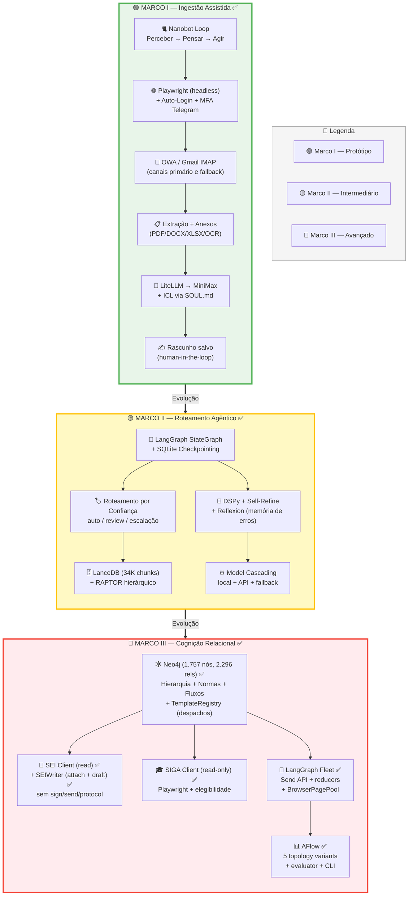
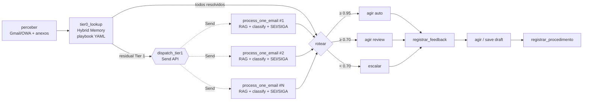
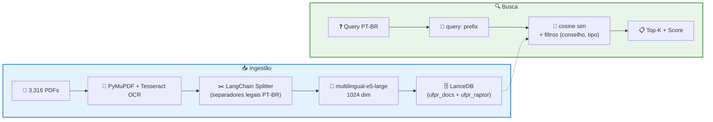

# Arquitetura — Sistema de Automação Burocrática UFPR

> **Status atual:** Marcos I, II, II.5 e III ✅ completos. Refinamentos operacionais pendentes (validação em produção, ablations reais do AFlow, wire-up do BrowserPagePool em SEI/SIGA).
> Veja `TASKS.md` para o roadmap restante.

## Visão geral das 3 fases

## Stack por componente

| Componente | Tecnologia | Notas |
|---|---|---|
| **Linguagem** | Python ≥ 3.12 | |
| **Orquestrador** | LangGraph (Marco II+) / Nanobot loop (Marco I) | StateGraph + SQLite checkpointing |
| **LLM** | LiteLLM → MiniMax-M2 | Provider-agnostic. Cascading: local/Ollama → API → fallback |
| **Memória vetorial** | LanceDB + RAPTOR | 34.285 chunks, multilingual-e5-large (1024 dim), Google Drive |
| **Memória relacional** | Neo4j | 1.757 nós, 2.296 relações (órgãos, normas, fluxos, templates) |
| **Otimização de prompts** | DSPy (GEPA / MIPROv2) | Signatures + métricas customizadas |
| **Episódica** | ReflexionMemory | Análise + recall de erros passados |
| **Canal e-mail** | Gmail IMAP (primário) / Playwright OWA (fallback) | Auto-login + MFA via Telegram (OWA) |
| **Sistemas legados** | Playwright (SEI, SIGA) | Read-only por enquanto |
| **Anexos** | PyMuPDF, python-docx, openpyxl, Tesseract | OCR fallback para PDFs escaneados/imagens |
| **Scheduler** | APScheduler (3x/dia configurável) | `--schedule [--once]` |
| **Feedback UI** | Streamlit | Dashboard, revisão, estatísticas |

## Pipeline LangGraph (Marco II + III com Fleet)

Após Marco III, o pipeline default usa **fan-out via `Send` API**: cada email Tier 1 (não resolvido pelo playbook Tier 0) vira um sub-agent paralelo que faz `rag_retrieve + classificar + consultar_sei + consultar_siga` independentemente. Reducers `Annotated[..., _merge_dict]` em `graph/state.py` mesclam os dicts paralelos sem last-write-wins.

A topologia é selecionável via `AFLOW_TOPOLOGY`. Variantes registradas em `aflow/topologies.py`:

| Topologia | Descrição |
|---|---|
| `fleet` (default) | Fan-out via `Send` API — paraleliza Tier 1 |
| `baseline` | Pipeline linear pré-Fleet (sequencial) — para AFlow ablations |
| `skip_rag_high_tier0` | Variante baseline ablation (alias no MVP) |
| `no_self_refine` | Variante fleet ablation (alias no MVP) |
| `fleet_no_siga` | Variante fleet sem consulta SIGA (alias no MVP) |

## RAG — Pipeline de ingestão e busca

**Cobertura:** 99,2% (3.288/3.316 PDFs, 70 recuperados via OCR). Detalhes em `RAG_INGESTION_REPORT.md`.

## GraphRAG (Marco III)

Grafo Neo4j construído via `seed.py` (conhecimento estruturado: hierarquia, fluxos, templates) e `enrich.py` (extração de normas do RAG vetorial via regex):

| Tipo de nó | Quantidade | Origem |
|---|---|---|
| Órgãos | 21 | seed (SOUL.md) |
| Pessoas | 12 | seed |
| Normas | ~1.600 | enrich (extraídas dos PDFs) |
| Fluxos | 6 (47 etapas) | seed |
| Templates | 15 | seed (ClaudeCowork) |
| Tipos de processo SEI | 20 | seed |
| Abas SIGA | 8 | seed |

**Vigência:** cada norma tem `status` (`vigente` 1.281 / `alterada` 174 / `revogada` 148). Relações `ALTERA`, `REVOGA`, `CONSOLIDADA_EM` formam a cadeia de linhagem. `fonte_rag` aponta para o PDF original no LanceDB.

**Templates de despacho** (Marco III): movidos de `sei/client.py` para o grafo. `_seed_templates` em `graphrag/seed.py` persiste `Template.conteudo` e `Template.despacho_tipo`. `graphrag/templates.py:TemplateRegistry` busca por tipo via Cypher com cache in-memory; é consumido por `sei/client.py:prepare_despacho_draft` e `sei/writer.py:save_despacho_draft`.

**Retrieval:** o nó `rag_retrieve` (ou `process_one_email` no Fleet) combina:
1. `RaptorRetriever.search()` — collapsed-tree vetorial
2. `GraphRetriever` — workflow + normas + templates + hints SIGA + contatos
3. `ReflexionMemory.retrieve()` — erros passados como contexto negativo

Ver `graphrag/README.md` para detalhes.

## Marco III — Componentes novos

### LangGraph Fleet (`graph/fleet.py`)

Sub-agents paralelos via `langgraph.types.Send`. `dispatch_tier1` é a conditional edge router após `tier0_lookup`: se todos os emails foram resolvidos pelo playbook, retorna `"rotear"`; caso contrário, retorna `[Send("process_one_email", SubState(email=e, ...)) for e in tier1_emails]`. Cada sub-agent executa o pipeline Tier 1 completo (RAG + classify + SEI/SIGA conditional) e retorna um partial state cujos dicts são mesclados pelos reducers `Annotated[..., _merge_dict]` em `graph/state.py`.

### BrowserPagePool (`graph/browser_pool.py`)

Pool assíncrono de pages Playwright derivadas de um único `BrowserContext` compartilhado. `acquire()` é um `asynccontextmanager` com `asyncio.Semaphore` (default size 3, configurável via `FLEET_BROWSER_POOL_SIZE`). Pronto para reuso pelos helpers `_consult_sei_for_email` / `_consult_siga_for_email` (wire-up final pendente — atualmente cada call ainda spawna browser próprio).

### SEIWriter (`sei/writer.py`)

Camada de escrita controlada para SEI. **Public API limitada a `attach_document` e `save_despacho_draft`**. Não existem métodos `sign()`, `send()`, `protocol()` ou `finalize()` — a ausência arquitetural é o mecanismo principal de safety. Belt + suspenders:

1. **Whitelist do public API**: `test_writer_public_api_is_only_attach_and_draft` falha se qualquer método novo aparecer.
2. **6 testes regressivos** verificam ausência de `sign`, `assinar`, `send`, `enviar`, `enviar_processo`, `protocol`, `protocolar`, `finalize`.
3. **Static scan** do código fonte por `.click('text=Assinar')`, `.click('text=Enviar')`, `.click('text=Protocolar')` em `test_no_method_body_references_forbidden_keywords`.
4. **`_FORBIDDEN_SELECTORS` runtime guard**: `_safe_click(selector)` valida cada clique contra a lista de tokens proibidos antes de executar; lança `PermissionError` se algum bater.
5. **Audit trail**: cada operação grava screenshot pré + DOM dump pós + entrada JSONL em `SEI_WRITE_ARTIFACTS_DIR/audit.jsonl` com sha256 do arquivo/conteúdo.

### TemplateRegistry (`graphrag/templates.py`)

Busca despachos do Neo4j com cache in-memory. Substitui as constantes hardcoded antes embutidas em `sei/client.py` (lines 20-79, removidas pelo Wave 1). Lazy import dentro de `prepare_despacho_draft` para evitar ciclo SEI ↔ GraphRAG. Fallback `campos_pendentes=["neo4j_unavailable"]` se Neo4j off.

### USE_DSPY tri-state gate (`graph/nodes.py`)

`_should_use_dspy()` lê `settings.USE_DSPY` e roteia entre `_classify_with_dspy` (DSPy SelfRefineModule com prompt compilado) e `_classify_with_litellm` (LiteLLM direto):

- `"off"` → sempre LiteLLM
- `"on"` → DSPy obrigatório (raise se `dspy` ausente ou se não houver `gepa_optimized.json`/`mipro_optimized.json`)
- `"auto"` (default) → DSPy se importável e prompt compilado existe, senão LiteLLM com log INFO

### AFlow (`aflow/`)

Topology evaluator mínimo. **Não é busca neural** — é um registry de topologias hand-authored + evaluator + CLI. `aflow/topologies.py` registra 5 variantes (atualmente 3 são aliases para futura implementação de ablations reais). `aflow/evaluator.py:evaluate()` roda cada topologia contra um eval set (vindo de `feedback_data/` ou synthetic do `optimize.py`) com `metric_fn` e `invoke_fn` plugáveis (stub-friendly para testes). `aflow/optimizer.py:pick_best_topology()` retorna a melhor por (accuracy, -latency, -errors) e escreve report JSON. CLI: `python -m ufpr_automation.aflow.cli --topologies all --limit 20`.
