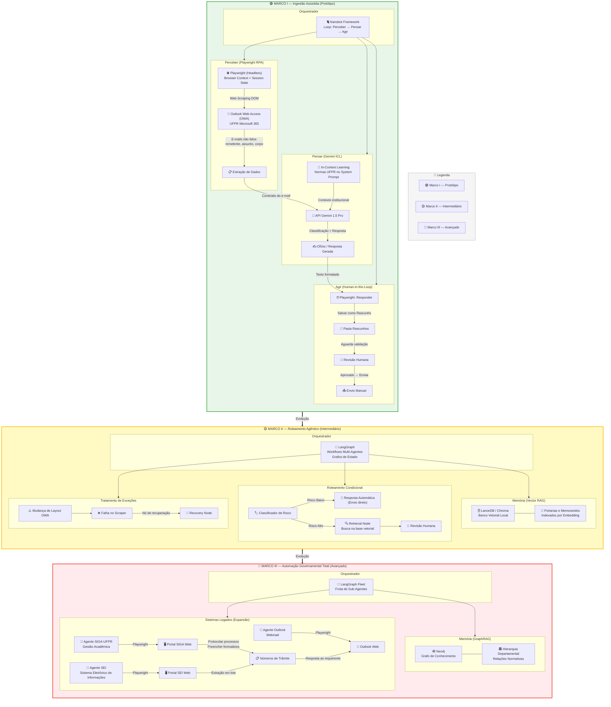
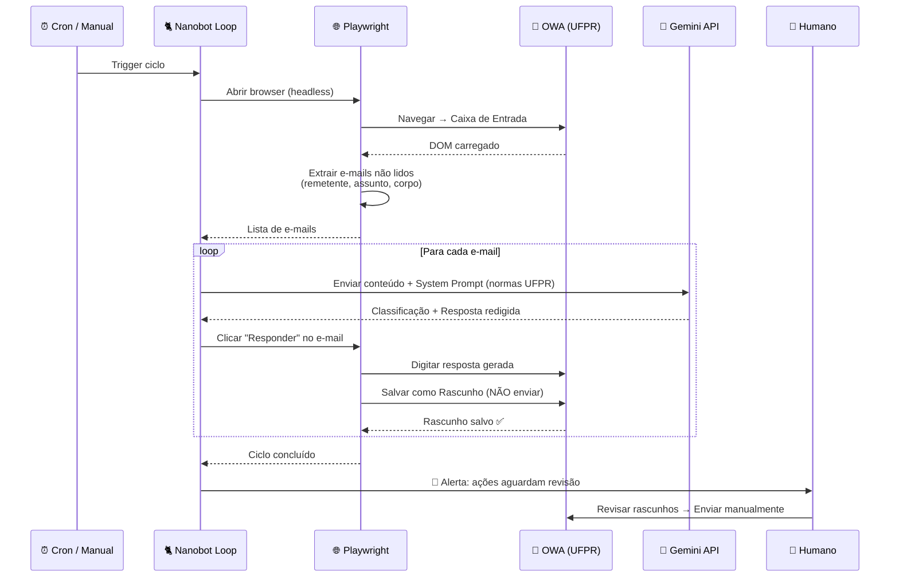

# Sistema de Automação Burocrática da UFPR — Diagrama de Arquitetura

## Visão Geral das 3 Fases de Maturidade

## Stack Tecnológica por Fase

| Componente        | Marco I (Protótipo)         | Marco II (Intermediário)     | Marco III (Avançado)          |
|-------------------|-----------------------------|------------------------------|-------------------------------|
| **Linguagem**     | Python                      | Python                       | Python                        |
| **Orquestrador**  | Nanobot (loop nativo)       | LangGraph                    | LangGraph (Fleet)             |
| **Motor Cognitivo** | Gemini 1.5 Pro (ICL)      | Gemini 1.5 Pro (RAG)         | Gemini 1.5 Pro (GraphRAG)     |
| **Memória**       | System Prompt (In-Context)  | LanceDB / Chroma (Vetorial)  | Neo4j (Grafo de Conhecimento) |
| **Interface I/O** | Playwright → OWA            | Playwright → OWA             | Playwright → OWA + SIGA + SEI |
| **Autonomia**     | Rascunho + Revisão Humana   | Auto (baixo risco) + Humano  | Totalmente autônomo           |
| **Tratamento Erro** | Logs no terminal          | Recovery nodes (LangGraph)   | Auto-healing + alertas        |

## Fluxo de Dados — Marco I (Detalhado)

