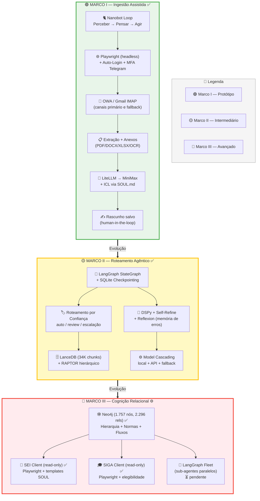
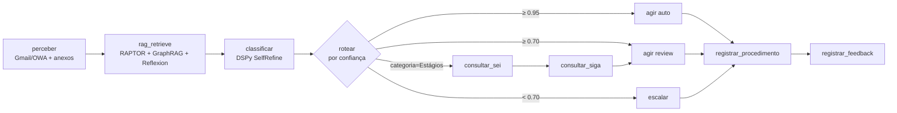
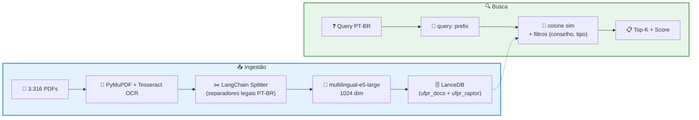

# Arquitetura — Sistema de Automação Burocrática UFPR

> **Status atual:** Marcos I, II e II.5 ✅ completos. Marco III parcial (GraphRAG ✅, demais pendentes).
> Veja `TASKS.md` para o roadmap restante.

## Visão geral das 3 fases

## Stack por componente

| Componente | Tecnologia | Notas |
|---|---|---|
| **Linguagem** | Python ≥ 3.12 | |
| **Orquestrador** | LangGraph (Marco II+) / Nanobot loop (Marco I) | StateGraph + SQLite checkpointing |
| **LLM** | LiteLLM → MiniMax-M2 | Provider-agnostic. Cascading: local/Ollama → API → fallback |
| **Memória vetorial** | LanceDB + RAPTOR | 34.285 chunks, multilingual-e5-large (1024 dim), Google Drive |
| **Memória relacional** | Neo4j | 1.757 nós, 2.296 relações (órgãos, normas, fluxos, templates) |
| **Otimização de prompts** | DSPy (GEPA / MIPROv2) | Signatures + métricas customizadas |
| **Episódica** | ReflexionMemory | Análise + recall de erros passados |
| **Canal e-mail** | Gmail IMAP (primário) / Playwright OWA (fallback) | Auto-login + MFA via Telegram (OWA) |
| **Sistemas legados** | Playwright (SEI, SIGA) | Read-only por enquanto |
| **Anexos** | PyMuPDF, python-docx, openpyxl, Tesseract | OCR fallback para PDFs escaneados/imagens |
| **Scheduler** | APScheduler (3x/dia configurável) | `--schedule [--once]` |
| **Feedback UI** | Streamlit | Dashboard, revisão, estatísticas |

## Pipeline LangGraph (Marco II+)

## RAG — Pipeline de ingestão e busca

**Cobertura:** 99,2% (3.288/3.316 PDFs, 70 recuperados via OCR). Detalhes em `RAG_INGESTION_REPORT.md`.

## GraphRAG (Marco III)

Grafo Neo4j construído via `seed.py` (conhecimento estruturado: hierarquia, fluxos, templates) e `enrich.py` (extração de normas do RAG vetorial via regex):

| Tipo de nó | Quantidade | Origem |
|---|---|---|
| Órgãos | 21 | seed (SOUL.md) |
| Pessoas | 12 | seed |
| Normas | ~1.600 | enrich (extraídas dos PDFs) |
| Fluxos | 6 (47 etapas) | seed |
| Templates | 15 | seed (ClaudeCowork) |
| Tipos de processo SEI | 20 | seed |
| Abas SIGA | 8 | seed |

**Vigência:** cada norma tem `status` (`vigente` 1.281 / `alterada` 174 / `revogada` 148). Relações `ALTERA`, `REVOGA`, `CONSOLIDADA_EM` formam a cadeia de linhagem. `fonte_rag` aponta para o PDF original no LanceDB.

**Retrieval:** o nó `rag_retrieve` do LangGraph combina:
1. `RaptorRetriever.search()` — collapsed-tree vetorial
2. `GraphRetriever` — workflow + normas + templates + hints SIGA + contatos
3. `ReflexionMemory.retrieve()` — erros passados como contexto negativo

Ver `graphrag/README.md` para detalhes.
