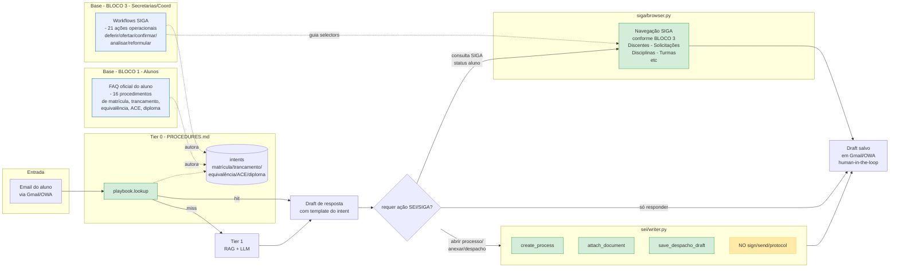
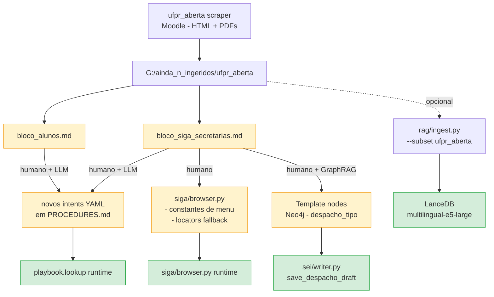

# Fluxo Geral — UFPR Aberta → Playbook Tier 0 → SIGA/SEI

> Visão **cross-bloco** combinando material dos BLOCO 1 (Alunos) e BLOCO 3
> (Secretarias/Coord) do curso "Conheça o SIGA!" com a arquitetura do
> pipeline (`graph/builder.py`, `procedures/playbook.py`, `siga/browser.py`,
> `sei/writer.py`).
>
> Origem: `https://ufpraberta.ufpr.br/course/view.php?id=9` (scraped 2026-04-14).
> Detalhe por atividade: `bloco_alunos.md`, `bloco_siga_secretarias.md`.

---

## 1. Diagrama geral: email de aluno → resposta + ação SIGA/SEI

**Leitura:**

- As duas caixas base (BLOCO 1 e BLOCO 3) não estão no runtime — são **fontes
  autorativas** para authoring: o material de Alunos vira `template` de
  intents (o texto vai no email de resposta); o de Secretarias vira **passos
  SIGA + selectors** para `siga/browser.py` e/ou `save_despacho_draft`.
- `NO sign/send/protocol` é a fronteira arquitetural do `SEIWriter` — aparece
  no diagrama como lembrete visual.

---

## 2. Mapa de cobertura: dúvida de aluno → intent → ação

Tabela derivada dos títulos de BLOCO 1 + BLOCO 3. Cada linha é uma dúvida
recorrente: o que o aluno pergunta (BLOCO 1), qual ação a secretaria precisa
fazer (BLOCO 3), qual intent já existe em PROCEDURES.md ou deveria existir.

| Dúvida do aluno (BLOCO 1) | Ação da secretaria/coord (BLOCO 3) | Intent em PROCEDURES.md | Status |
|---|---|---|---|
| Como solicitar matrícula | Funcionamento da matrícula on-line; confirmar calouros | `matricula_*` | existe |
| Como ajustar matrícula | Fazer ajuste de matrícula dos alunos | `matricula_*` | existe (genérico) |
| Como cancelar matrícula em disciplina | Deferir/indeferir cancelamento em disciplinas | `cancelamento_prazo`, `cancelamento_abandono` | existe |
| Matrícula em disciplina eletiva | Analisar solicitações de eletiva | **faltante** | **criar** `matricula_eletiva` |
| Como trancar / destrancar curso | Deferir/indeferir trancamento | `trancamento_*` | existe |
| Exame de Adiantamento | Processo de Exame de Adiantamento (mesmo título) | **faltante** | **criar** `exame_adiantamento` |
| Exame de Aproveitamento / Equivalência | Análise de solicitações de equivalência (coord + depto) | `aproveitamento_*` | existe (revisar) |
| Histórico / declaração / comprovante | — | **faltante** | **criar** `documentos_academicos` |
| Upload documentos pessoais / foto / nome social / vacina | Visualizar comprovante de vacinação | **faltante (baixa prioridade)** | **criar** `cadastro_discente` |
| ACE III, IV, V (Extensão) | Deferir/indeferir ACE | **faltante** | **criar** `creditacao_extensao` |
| Diploma Digital (egresso) | Diploma Digital - manual coord | `diploma_*` | existe (revisar com manual novo) |
| Colação de Grau | Como solicitar colação sem solenidade | `colacao_grau_*` | existe |
| — (não aparece em BLOCO 1) | Cadastrar Atividades Formativas | **faltante** | **criar** `atividades_formativas` |
| — | Reformulação de curso, oferta de turma, análise abandono/indicadores | (fora do escopo email de aluno) | — |

**Sinalizações para próxima iteração de authoring:**

- 6 intents novos (`matricula_eletiva`, `exame_adiantamento`,
  `documentos_academicos`, `cadastro_discente`, `creditacao_extensao`,
  `atividades_formativas`).
- 2 intents existentes a revisar com material mais recente do BLOCO 1/3
  (`aproveitamento_*`, `diploma_*`).
- `siga/browser.py` recebe 21 sequências de navegação documentadas em
  `bloco_siga_secretarias.md` → podem virar constantes/`locators.py`
  específicos (ex.: `SIGA_MENU_TRANCAMENTO`, `SIGA_BTN_DEFERIR_ELETIVA`).

---

## 3. Fluxo de authoring (como o material aqui vira código/intents)

**Legenda:**

- **Amarelo** = passo de authoring (humano + LLM decidem).
- **Verde** = artefato consumido em runtime.
- Ingestão RAG dos `.md` é **opcional**: decisão do usuário depois de
  revisar o conteúdo (ver `CLAUDE.md → ufpr_aberta`).

---

## 4. Referências cruzadas

- Scraper: `ufpr_automation/ufpr_aberta/{browser,scraper,__main__}.py`
- Playbook runtime: `ufpr_automation/procedures/playbook.py`
- SIGA nav: `ufpr_automation/siga/{browser,client}.py`
- SEI writer: `ufpr_automation/sei/writer.py`
- Graph orchestrator: `ufpr_automation/graph/builder.py` (`tier0_lookup`)
- Raw dump: `G:\Meu Drive\ufpr_rag\docs\ainda_n_ingeridos\ufpr_aberta\`
