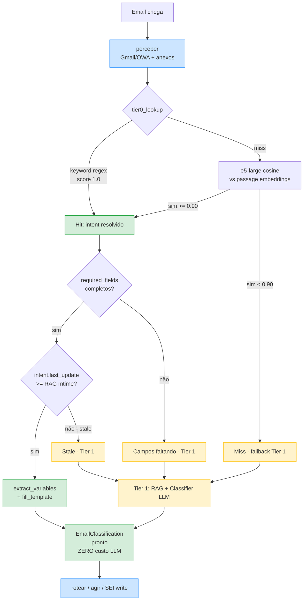

# Playbook de Procedimentos — Tier 0

> **Tier 0 da Memória Híbrida**: procedimentos repetitivos da Secretaria do
> Curso de Design Gráfico (UFPR) em formato estruturado, para roteamento com
> custo quase zero (sem RAG, sem LLM de classificação).
>
> **Fluxo:**
> 1. `tier0_lookup` faz match por keywords (regex) → score 1.0.
> 2. Miss → match semântico (e5-large, cosine > 0.90) contra `intent_name + keywords`.
> 3. Hit → preenche `template`, valida `required_fields`, finaliza.
> 4. Miss / `last_update` < mtime do RAG → fallback para Tier 1 (RAG + LLM).
>
> **Prioridade dos intents** (peso real medido em março/2026,
> `base_conhecimento/manual_sei.txt`):
>
> | Tipo de processo SEI | Qtde | Intents Tier 0 |
> |---|---|---|
> | Estágio Não Obrigatório | 238 | `estagio_nao_obrig_*` |
> | Informações e Documentos | 132 | (genérico → Tier 1) |
> | Registro de Diplomas | 62 | `diploma_*` |
> | Estágio Obrigatório | 60 | `estagio_obrig_*` |
> | Dispensa/Aproveitamento de Disciplinas | 60 | `aproveitamento_*` |
> | Voluntariado Acadêmico | 42 | `voluntariado_*` |
> | Matrículas | 30 | `matricula_*` |
> | Expedição de Diploma | 23 | `diploma_*` |
> | Trancamento/Destrancamento | 13 | `trancamento_*` |
> | Cancelamento por Abandono | 12 | `cancelamento_abandono` |
> | Cancelamento por Prazo | 11 | `cancelamento_prazo` |
> | Colação de Grau | 11+5+3 | `colacao_grau_*` |
>
> **Bases normativas chave**:
>
> - **Lei 11.788/2008** — Lei Federal de Estágios
> - **Resolução 46/10-CEPE** — Estágios na UFPR
> - **Resolução 70/04-CEPE** — Atividades Formativas
> - **Resolução 92/13-CEPE** (alterada pela **39/18-CEPE**) — Dispensa /
>   Isenção / Aproveitamento de disciplinas
> - **IN 01/16-PROGRAD** — Trancamento / Destrancamento de Curso
> - **IN 01/12-CEPE** — Estágios não obrigatórios externos
> - **IN 01/13-CEPE** — Estágios dentro da UFPR
>
> **Contatos institucionais (FichaDoCurso, mar/2026)**:
>
> - Secretaria DG: `design.grafico@ufpr.br` · (41) 3360-5360
> - COAPPE / Unidade de Estágios: `estagio@ufpr.br` · (41) 3310-2706
> - PROGEPE (estágios remunerados na UFPR): `progepe@ufpr.br`
> - Endereço Coordenação: Rua General Carneiro, 460, 8º andar, sala 801, Centro, Curitiba/PR
>
> **Placeholders**: `[NOME_CAMPO]` é preenchido pelo extractor.
> `{{ assinatura_email }}` vem de `settings.ASSINATURA_EMAIL`.
> Placeholders desconhecidos sobrevivem para revisão humana.
>
> **Manutenção**: ao alterar `template`, atualize `last_update` para a data
> corrente (YYYY-MM-DD). A staleness check usa esse campo para invalidar
> intents quando a base RAG é reingerida.

---

## Fluxo Tier 0 (diagrama)



> Diagrama do que `graph/builder.py:build_graph()` faz em runtime.
> Hits verdes = caminho Tier 0 (sem RAG, sem LLM classificador).
> Caminhos amarelos = fallback pra Tier 1 (custa RAG + LLM).

---

## §1. Estágio Não Obrigatório (238 processos — categoria mais comum)

```intent
intent_name: estagio_nao_obrig_acuse_inicial
keywords:
  - "TCE"
  - "Termo de Compromisso de Estágio"
  - "Termo de Estágio"                   # forma curta usada por alunos
  - "Termo de Estágio para assinatura"   # literal observado em email real 2026-04-22
  - "termo de estágio para assinatura"
  - "novo estágio"
  - "iniciar estágio"
  - "abrir estágio"
  - "encaminhar TCE"
  - "começar estágio"
  - "assinatura TCE"
  - "assinatura do termo"
  - "assinar termo de estágio"
  - "assinar TCE"
  - "Contrato de Estágio"            # variante observada 2026-04-29 (Nicollas)
  - "contrato de estágio"
  - "contrato estágio"
  - "envio do contrato de estágio"
categoria: "Estágios"
action: "Redigir Resposta"
sei_action: "create_process"
sei_process_type: "Graduação/Ensino Técnico: Estágios não Obrigatórios"
acompanhamento_especial_grupo: "Estágio não obrigatório"  # POP-38: após create_process, incluir o processo neste grupo de Acompanhamento Especial para organização/rastreio pós-conclusão
required_fields:
  - nome_aluno
  - grr
  - nome_concedente
  - data_inicio
  - data_fim
# numero_tce é opcional — nem todo TCE tem número (depende da origem).
# extract_variables preenche quando encontrar; template deixa [NUMERO_TCE]
# para revisão humana quando ausente.
required_attachments:
  - "TCE"                 # Termo de Compromisso de Estágio assinado
                          # (o Plano de Atividades via de regra vem
                          #  embutido no mesmo PDF do TCE — não é anexo
                          #  separado no SEI)
blocking_checks:
  - "siga_matricula_ativa"              # HARD: trancada/cancelada/integralizada
  - "siga_reprovacoes_ultimo_semestre"  # SOFT: > 1 → exigir justificativa formal
  - "siga_reprovacao_por_falta"         # HARD: regra específica Design Gráfico
  - "siga_curriculo_integralizado"      # HARD: não pode estágio não-obrig. se já integralizou
  - "siga_ch_simultaneos_30h"           # HARD: soma de estágios > 30h/semana
  - "siga_concedente_duplicada"         # HARD: dois estágios simultâneos na mesma concedente
  - "data_inicio_retroativa"            # HARD: início < hoje
  - "data_inicio_antecedencia_minima"   # HARD: início - hoje < 2 dias úteis
  - "tce_jornada_sem_horario"           # HARD: TCE não especifica horário da jornada
  - "tce_jornada_antes_meio_dia"        # HARD (exceto se curriculo_integralizado): aulas de manhã
  - "sei_processo_vigente_duplicado"    # HARD: já existe processo VIGENTE do mesmo tipo para este aluno
  - "supervisor_formacao_compativel"    # SOFT: formação do supervisor não afim a Design → exigir Declaração de Experiência (form PROGRAD)
sources:
  - "Lei 11.788/2008"
  - "Resolução 46/10-CEPE"
  - "IN 01/12-CEPE"
  - "Regulamento de Estágio do Curso de Design Gráfico (2024)"
  - "SOUL.md §7, §8.1, §11, §12, §14.1, §15.1"
  - "base_conhecimento/manual_sei.txt §Estágio Não Obrigatório"
  - "base_conhecimento/estagios/GUIA_ESTAGIOS_DG.txt §SUPERVISOR"
last_update: "2026-04-22"
confidence: 0.90

# Email de acuse ao aluno — usado APÓS o processo SEI ter sido criado e
# o TCE + Despacho anexados, para que a variável [NUMERO_PROCESSO_SEI] seja
# preenchida com o número real do processo recém-criado.
template: |
  Prezado(a) [NOME_ALUNO],

  A Coordenação do Curso de Design Gráfico acusa o recebimento do Termo de
  Compromisso de Estágio nº [NUMERO_TCE] do(a) estudante [NOME_ALUNO], GRR
  [GRR], a ser realizado na [NOME_CONCEDENTE], no período de [DATA_INICIO]
  a [DATA_FIM].

  A documentação foi incluída no processo SEI nº [NUMERO_PROCESSO_SEI] e
  encaminhada à Unidade de Estágios da COAPPE/PROGRAP (estagio@ufpr.br) para
  verificação e autorização. Eventuais pendências serão comunicadas
  oportunamente.

  Informamos que o estágio somente poderá ter início após a autorização
  formal pela UE/COAPPE, conforme estabelece a Resolução 46/10-CEPE e o
  Regulamento de Estágio do Curso de Design Gráfico. Não é permitida
  homologação com data retroativa, motivo pelo qual o TCE deve chegar com
  pelo menos 2 dias úteis de antecedência ao início pretendido.

  Em caso de dúvidas, a COAPPE atende pelo telefone (41) 3310-2706.

  {{ assinatura_email }}

# Despacho SEI (SOUL.md §14.1) — incluído no processo junto com o TCE.
# Os campos [HORAS_DIARIAS] / [HORAS_SEMANAIS] / datas / nome da concedente
# são extraídos do texto do TCE anexado pelo ``extract_variables`` estendido.
despacho_template: |
  Prezados,

          A Coordenação do Curso de Design Gráfico acusa o recebimento do Termo de
  Compromisso de Estágio nº [NUMERO_TCE] (SEI [NUMERO_SEI_TCE]) e manifesta-se favorável
  à realização do Estágio Não Obrigatório do estudante [NOME_ALUNO_MAIUSCULAS],
  [GRR], na [NOME_CONCEDENTE_MAIUSCULAS], no período de [DATA_INICIO] a [DATA_FIM],
  com jornada de [HORAS_DIARIAS] horas diárias, totalizando [HORAS_SEMANAIS] horas
  semanais, sendo a jornada realizada de forma compatível com as atividades
  acadêmicas.

          Por este despacho, declaro também minha assinatura no referido documento, que
  corresponde tanto como professora orientadora do estágio quanto como coordenadora de
  curso, e informamos que ratifica-se integralmente o Termo de Compromisso de Estágio
  nº [NUMERO_TCE], anexo a este processo, para todos os fins legais.
```

```intent
intent_name: estagio_nao_obrig_aditivo
keywords:
  - "termo aditivo"
  - "aditivo de estágio"
  - "prorrogação de estágio"
  - "prorrogar estágio"
  - "aditivo TCE"
  - "alteração de TCE"
  - "nova vigência"
categoria: "Estágios"
action: "Redigir Resposta"
# Processo SEI já existe (aberto no TCE original) — fluxo é append: anexar
# o Termo Aditivo + redigir despacho favorável. Não criar processo novo.
sei_action: "append_to_existing"
required_fields:
  - nome_aluno
  - numero_aditivo
  - data_termino_novo
  - nome_concedente
# numero_tce é opcional — quando presente, localiza processo SEI existente;
# quando ausente, agir_estagios busca processo por nome_aluno + GRR.
required_attachments:
  - "Termo Aditivo"             # PDF do aditivo assinado
blocking_checks:
  - "aditivo_antes_vencimento_tce"    # HARD: aditivo deve chegar antes da data de término do TCE vigente
  - "duracao_total_ate_24_meses"      # HARD: duração total (TCE + aditivos) ≤ 24 meses (Lei 11.788/08 Art. 11)
  - "sei_processo_tce_existente"      # HARD: deve existir processo SEI vigente do TCE original do aluno
sources:
  - "Resolução 46/10-CEPE"
  - "Lei 11.788/2008 Art. 11"
  - "SOUL.md §8.2"
last_update: "2026-04-09"
confidence: 0.88
template: |
  Prezado(a) [NOME_ALUNO],

  A Coordenação do Curso de Design Gráfico recebeu o Termo Aditivo nº
  [NUMERO_ADITIVO], referente ao seu estágio na [NOME_CONCEDENTE]
  (TCE nº [NUMERO_TCE]). O documento será incluído no processo SEI já
  existente e encaminhado à COAPPE com manifestação favorável da
  Coordenação.

  Após análise pela COAPPE, a nova data de término passará a ser
  [DATA_TERMINO], preservadas as demais condições do TCE original.
  Lembramos que:

  - O aditivo deve **obrigatoriamente** chegar antes da data de término
    do TCE atual — após o vencimento, o estágio encerra-se automaticamente
    e não é possível prorrogar retroativamente.
  - A duração total do mesmo estágio na mesma concedente não pode
    ultrapassar 24 meses (Art. 11 da Lei 11.788/2008).
  - Novo Relatório Parcial deverá ser apresentado em até 6 meses, ou
    Relatório Final na conclusão das atividades.

  {{ assinatura_email }}

# Despacho SEI (manifestação favorável ao aditivo, anexado ao processo
# existente do TCE original).
despacho_template: |
  Prezados,

          A Coordenação do Curso de Design Gráfico manifesta-se favorável ao Termo
  Aditivo nº [NUMERO_ADITIVO] ao Termo de Compromisso de Estágio nº [NUMERO_TCE]
  do(a) estudante [NOME_ALUNO_MAIUSCULAS], [GRR], junto à [NOME_CONCEDENTE_MAIUSCULAS],
  com nova data de término em [DATA_TERMINO_NOVO], preservadas as demais condições
  do TCE original.

          Por este despacho, ratifica-se integralmente o referido Termo Aditivo, anexo
  a este processo, para todos os fins legais.
```

```intent
intent_name: estagio_nao_obrig_conclusao
keywords:
  - "conclusão de estágio"
  - "rescisão de estágio"
  - "encerramento do estágio"
  - "relatório final de estágio"
  - "termo de rescisão"
  - "finalizar estágio"
  - "rescisão"                          # forma curta (ambígua, mas só estagiários enviam)
  - "termo de rescisão de estágio"
  - "rescisão antecipada de estágio"
  - "termo de conclusão de estágio"
categoria: "Estágios"
action: "Redigir Resposta"
# Processo SEI já existe — append: anexar Termo de Rescisão + Relatório Final
# + redigir despacho de homologação. Não criar processo novo.
sei_action: "append_to_existing"
required_fields:
  - nome_aluno
  - nome_concedente
  - data_termino
# numero_tce é opcional — quando presente, localiza processo SEI existente;
# quando ausente, agir_estagios busca processo por nome_aluno + GRR.
required_attachments:
  - "Termo de Rescisão"         # ou "Termo de Conclusão" (conforme caso)
  - "Relatório Final"           # exigência Lei 11.788/08 Art. 9º §1º
blocking_checks:
  - "sei_processo_tce_existente"      # HARD: deve existir processo SEI vigente do TCE do aluno
  - "relatorio_final_assinado_orientador"   # HARD: Relatório Final assinado pelo professor orientador
sources:
  - "Resolução 46/10-CEPE"
  - "SOUL.md §8.3"
  - "SOUL.md §15.4"
last_update: "2026-04-09"
confidence: 0.88
template: |
  Prezado(a) [NOME_ALUNO],

  A Coordenação do Curso confirma o recebimento do Relatório Final de
  Estágio e do Termo de Rescisão/Conclusão referentes ao seu estágio na
  [NOME_CONCEDENTE]. Os documentos serão incluídos no processo SEI
  existente e encaminhados à COAPPE para homologação.

  Após a homologação:

  - **Estágio não obrigatório**: o certificado será emitido pela COAPPE em
    até 5 dias úteis e encaminhado por e-mail.
  - **Estágio obrigatório**: o lançamento de nota e frequência na
    disciplina de Estágio Supervisionado será realizado pela coordenação
    após a avaliação final pelo professor orientador.

  Em caso de dúvidas sobre a homologação, a COAPPE atende pelo
  e-mail estagio@ufpr.br ou telefone (41) 3310-2706.

  {{ assinatura_email }}

# Despacho SEI (homologação da conclusão/rescisão).
despacho_template: |
  Prezados,

          A Coordenação do Curso de Design Gráfico encaminha para homologação o
  Termo de Rescisão e o Relatório Final referentes ao estágio do(a) estudante
  [NOME_ALUNO_MAIUSCULAS], [GRR], junto à [NOME_CONCEDENTE_MAIUSCULAS], com data
  de término em [DATA_TERMINO], em conformidade com a Lei 11.788/2008 e a
  Resolução 46/10-CEPE.

          Solicita-se o encaminhamento à Unidade de Estágios da COAPPE para
  homologação e providências cabíveis.
```

```intent
intent_name: estagio_nao_obrig_relatorio_periodico
keywords:
  - "relatório de estágio"               # observado 2026-04-29 (Flávio Bach)
  - "relatório periódico de estágio"
  - "relatório parcial de estágio"
  - "relatório bimestral de estágio"
  - "relatório semestral de estágio"
  - "relatório de atividades de estágio"
  - "envio de relatório de estágio"
categoria: "Estágios"
action: "Redigir Resposta"
# Processo SEI já existe — append: anexar Relatório Periódico + redigir despacho
# de encaminhamento à COAPPE. NÃO confundir com Relatório FINAL (cobre intent
# estagio_nao_obrig_conclusao). Este intent cobre relatórios bimestrais/semestrais
# DURANTE o estágio (Lei 11.788/08 Art. 9º §1º — apresentação a cada 6 meses).
sei_action: "append_to_existing"
required_fields:
  - nome_aluno
  - nome_concedente
required_attachments:
  - "Relatório Periódico"        # ou Parcial/Bimestral/Semestral — Lei 11.788/08 Art. 9º §1º
blocking_checks:
  - "sei_processo_tce_existente"        # HARD: precisa ter processo SEI vigente do TCE
sources:
  - "Lei 11.788/2008 Art. 9º §1º"
  - "Resolução 46/10-CEPE"
  - "IN 01/12-CEPE"
last_update: "2026-04-29"
confidence: 0.85
template: |
  Prezado(a) [NOME_ALUNO],

  A Coordenação do Curso de Design Gráfico confirma o recebimento do
  Relatório Periódico de Estágio referente à sua atuação na
  [NOME_CONCEDENTE]. O documento será anexado ao processo SEI já existente
  e encaminhado à COAPPE para acompanhamento.

  Lembramos que o Relatório Periódico é exigência da Lei 11.788/08
  (Art. 9º §1º) — apresentação a cada 6 meses, até a conclusão do estágio.

  {{ assinatura_email }}

# Despacho SEI (encaminhamento de Relatório Periódico).
despacho_template: |
  Prezados,

          A Coordenação do Curso de Design Gráfico encaminha para anexação ao
  processo o Relatório Periódico de Estágio Não Obrigatório do(a) estudante
  [NOME_ALUNO_MAIUSCULAS], [GRR], junto à [NOME_CONCEDENTE_MAIUSCULAS], em
  cumprimento ao Art. 9º §1º da Lei 11.788/2008 e à Resolução 46/10-CEPE.

          Solicita-se o encaminhamento à Unidade de Estágios da COAPPE para
  acompanhamento das providências cabíveis.
```

```intent
intent_name: estagio_nao_obrig_pendencia
keywords:
  - "pendência de documentação"
  - "documentação incompleta"
  - "assinatura faltando"
  - "plano de atividades não anexado"
  - "corrigir TCE"
  - "documento incompleto"
categoria: "Estágios"
action: "Redigir Resposta"
# Sem sei_action: pendência é só email ao aluno pedindo correção/reenvio.
# Nenhuma ação no SEI — o processo só avança depois que o aluno reenviar
# documentação válida (cai em estagio_nao_obrig_acuse_inicial ou _aditivo).
required_fields:
  - nome_aluno
  - lista_pendencias              # extraída do email/attachments pelo classificador
llm_extraction_fields:
  - lista_pendencias              # texto livre — regex não cobre, usa LLM bounded (sem RAG) ainda dentro do Tier 0
sources:
  - "Resolução 46/10-CEPE"
  - "SOUL.md §15.5"
last_update: "2026-04-27"
confidence: 0.82
template: |
  Prezado(a) [NOME_ALUNO],

  Em análise à documentação referente ao seu estágio na [NOME_CONCEDENTE],
  identificamos a(s) seguinte(s) pendência(s):

  [LISTAR_PENDENCIAS]

  Solicitamos a regularização e o reenvio da documentação completa para
  que possamos dar prosseguimento ao processo. Enquanto a documentação
  estiver pendente, o estágio não poderá ser autorizado.

  Em caso de dúvidas, responda este e-mail. Para falar diretamente com
  a COAPPE: estagio@ufpr.br · (41) 3310-2706.

  {{ assinatura_email }}
```

---

## §2. Estágio Obrigatório (60 processos)

```intent
intent_name: estagio_obrig_matricula
keywords:
  - "estágio obrigatório matrícula"
  - "matricular em estágio supervisionado"
  - "disciplina de estágio supervisionado"
  - "Estágio Supervisionado"
  - "estágio curricular obrigatório"
categoria: "Estágios"
action: "Redigir Resposta"
required_fields:
  - nome_aluno
sources:
  - "Lei 11.788/2008"
  - "Resolução 46/10-CEPE"
  - "Regulamento de Estágio do Curso de Design Gráfico (2024)"
  - "PPC Design Gráfico — Currículos 2016 e 2020"
  - "manual_sei.txt §Estágio Obrigatório"
last_update: "2026-04-09"
confidence: 0.85
template: |
  Prezado(a) [NOME_ALUNO],

  Sobre o Estágio Supervisionado (estágio obrigatório), informamos:

  - É uma disciplina do PPC, com carga horária de **360 horas** prevista no
    4º ano. A matrícula é feita via SIGA no período regular.
  - Pré-requisitos de carga horária integralizada:
    - **Currículo 2020**: 1.035 horas (855h obrigatórias + 180h optativas).
    - **Currículo 2016**: 1.440 horas integralizadas.
  - Avaliação: defesa oral + relatório, nota mínima 50/100.
  - Frequência mínima: 75% da carga horária.
  - Não emite certificado para alunos da UFPR; o seguro é pago pela UFPR.
  - Estágios obrigatórios em órgãos públicos não podem ser remunerados
    (Orientação Normativa 02/2016-MPOG).

  O processo no SEI é aberto pela Coordenação no tipo "Graduação/Ensino
  Técnico: Estágio Obrigatório" e contém: comprovante de matrícula na
  disciplina, TCE, relatórios e avaliação final do supervisor.

  Confirme em qual currículo está vinculado(a) e se já cumpriu os
  pré-requisitos de carga horária para que possamos orientar os próximos
  passos.

  {{ assinatura_email }}
```

---

## §3. Dispensa / Aproveitamento de Disciplinas (60 processos)

```intent
intent_name: aproveitamento_disciplinas
keywords:
  - "aproveitamento de disciplina"
  - "aproveitamento de estudos"
  - "dispensa de disciplina"
  - "dispensar disciplina"
  - "isenção de disciplina"
  - "validar disciplina cursada"
categoria: "Acadêmico / Aproveitamento de Disciplinas"
action: "Redigir Resposta"
required_fields:
  - nome_aluno
sources:
  - "Resolução 92/13-CEPE (alterada pela Resolução 39/18-CEPE)"
  - "manual_sei.txt §Dispensa/Isenção/Aproveitamento de disciplinas"
last_update: "2026-04-09"
confidence: 0.87
template: |
  Prezado(a) [NOME_ALUNO],

  Sobre o pedido de aproveitamento (dispensa/isenção) de disciplinas,
  informamos o procedimento padrão adotado pela Coordenação do Curso de
  Design Gráfico, conforme a **Resolução 92/13-CEPE** (alterada pela
  **Resolução 39/18-CEPE**):

  1. Abertura de requerimento via SIGA, juntando:
     - Histórico escolar oficial da instituição de origem (autenticado);
     - Ementa e programa completos da(s) disciplina(s) já cursada(s),
       com carga horária e bibliografia;
     - Plano de aulas, quando disponível.
  2. A Coordenação abrirá um processo SEI individual do tipo
     "Graduação/Ensino Técnico: Dispensa/Isenção/Aproveitamento de
     disciplinas".
  3. Análise pelo professor responsável pela disciplina equivalente na
     UFPR, que emite parecer sobre compatibilidade de conteúdo e carga
     horária.
  4. Homologação pelo Colegiado do Curso e registro no SIGA.

  A dispensa é concedida quando há compatibilidade mínima de conteúdo
  programático e carga horária, conforme análise do(a) docente
  responsável. Por favor, confirme que possui a documentação acima e
  encaminhe a solicitação pelo SIGA para que possamos abrir o processo.

  {{ assinatura_email }}
```

```intent
intent_name: equivalencia_disciplinas
keywords:
  - "equivalência de disciplina"
  - "equivalência de disciplinas"
  - "disciplina cursada em outra universidade"
  - "disciplina de outra IES"
  - "transferência de disciplina"
categoria: "Acadêmico / Equivalência de Disciplinas"
action: "Redigir Resposta"
required_fields:
  - nome_aluno
sources:
  - "Resolução 92/13-CEPE (alterada pela 39/18-CEPE)"
  - "manual_siga.txt §5.2 Equivalências"
last_update: "2026-04-09"
confidence: 0.85
template: |
  Prezado(a) [NOME_ALUNO],

  Sobre o pedido de **equivalência** de disciplinas, informamos:

  - A análise de equivalência de disciplinas cursadas em outras IES é
    feita pelo Colegiado do Curso de Design Gráfico, com base na
    Resolução 92/13-CEPE (alterada pela 39/18-CEPE).
  - O pedido é registrado pelo aluno no SIGA, em
    "Equivalências de disciplinas", e a Coordenação acompanha o trâmite
    em /siga/graduacao/equivalencias.
  - Documentação necessária: histórico oficial da IES de origem,
    ementa/programa da disciplina cursada (com carga horária e
    bibliografia) e, quando aplicável, declaração de aprovação.
  - Após o lançamento no SIGA, a Coordenação encaminha ao(s)
    professor(es) responsável(eis) pela disciplina equivalente para
    parecer e, em seguida, ao Colegiado para homologação.

  Confirme se já abriu a solicitação no SIGA e, em caso negativo, faça-o
  para que possamos dar andamento.

  {{ assinatura_email }}
```

```intent
intent_name: ajuste_disciplinas_quebra_barreira
keywords:
  - "quebra de barreira"
  - "quebrar barreira"
  - "dispensa de pré-requisito"
  - "cursar sem pré-requisito"
  - "adiantar disciplina"
  - "antecipar disciplina"
categoria: "Acadêmico / Ajuste de Disciplinas"
action: "Redigir Resposta"
required_fields:
  - nome_aluno
sources:
  - "PPC do Curso de Design Gráfico"
  - "Resolução 92/13-CEPE"
last_update: "2026-04-09"
confidence: 0.85
template: |
  Prezado(a) [NOME_ALUNO],

  Sobre o pedido de **quebra de barreira** (dispensa de pré-requisito),
  informamos que a análise é feita caso a caso pelo Colegiado do Curso de
  Design Gráfico, considerando:

  - Justificativa acadêmica do(a) estudante;
  - Parecer do(a) professor(a) responsável pela disciplina pretendida;
  - Impacto no fluxo curricular e no tempo de integralização;
  - Aderência ao PPC do curso (Currículo 2016 ou 2020, conforme o seu
    caso).

  Para solicitar, encaminhe via SIGA (Requerimento ao Colegiado) a
  justificativa escrita indicando:

  1. A disciplina pretendida e o(s) pré-requisito(s) a dispensar;
  2. O motivo acadêmico (ex.: disciplina equivalente cursada,
     conhecimento prévio comprovado, necessidade para ajuste de fluxo);
  3. Confirmação de que já discutiu a pretensão com o(a) professor(a) da
     disciplina.

  A deliberação do Colegiado será comunicada via SIGA. Ressaltamos que a
  quebra de barreira é excepcional e não constitui direito adquirido.

  {{ assinatura_email }}
```

---

## §4. Voluntariado Acadêmico (42 processos — frequente como AFC)

```intent
intent_name: voluntariado_academico
keywords:
  - "voluntariado acadêmico"
  - "programa de voluntariado"
  - "voluntário acadêmico"
  - "PVA"
  - "horas de voluntariado"
categoria: "Formativas"
action: "Redigir Resposta"
required_fields:
  - nome_aluno
sources:
  - "Resolução 70/04-CEPE (Atividades Formativas)"
  - "manual_sei.txt §Voluntariado Acadêmico (42 processos)"
last_update: "2026-04-09"
confidence: 0.85
template: |
  Prezado(a) [NOME_ALUNO],

  Sobre o **Programa de Voluntariado Acadêmico (PVA)**, informamos:

  - É uma forma reconhecida de cumprir horas de **Atividades Formativas
    Complementares (AFC)** do Curso de Design Gráfico, conforme a
    Resolução 70/04-CEPE.
  - A participação deve estar vinculada a um projeto institucional da
    UFPR (pesquisa, ensino ou extensão) com orientador docente
    responsável.
  - O processo no SEI é aberto pela Coordenação no tipo "Graduação:
    Programa de Voluntariado Acadêmico", instruído com:
    - Plano de trabalho assinado pelo orientador;
    - Cronograma e carga horária prevista;
    - Termo de adesão do estudante.
  - Ao final do período, o orientador emite relatório com a frequência e
    a carga horária cumprida, que é registrada como AFC no SIGA.

  Para detalhes sobre AFC do Curso de Design Gráfico, consulte:
  https://sacod.ufpr.br/coordesign/atividades-formativas-complementares-dg/

  Confirme se já tem orientador e plano de trabalho definidos para que
  possamos abrir o processo.

  {{ assinatura_email }}
```

---

## §5. Trancamento e Destrancamento de Curso (13 processos)

```intent
intent_name: trancamento_curso_primeiro
keywords:
  - "trancar o curso"
  - "trancamento de curso"
  - "primeiro trancamento"
  - "trancar matrícula curso"
  - "trancar curso este semestre"
  - "interromper o curso"
  - "pausar o curso"
categoria: "Acadêmico / Matrícula"
action: "Redigir Resposta"
required_fields:
  - nome_aluno
sources:
  - "Instrução Normativa 01/16-PROGRAD"
  - "manual_sei.txt §Trancamento/Destrancamento"
  - "manual_siga.txt §2.3 Trancamentos de Curso"
last_update: "2026-04-09"
confidence: 0.86
template: |
  Prezado(a) [NOME_ALUNO],

  Sobre o **trancamento de curso**, informamos o procedimento conforme a
  **Instrução Normativa 01/16-PROGRAD**:

  - O **1º trancamento** é **imotivado** — basta abrir o requerimento via
    SIGA dentro do prazo definido pelo calendário acadêmico vigente.
  - Os **2º e 3º trancamentos** exigem justificativa escrita e
    documentação comprobatória (ex.: atestado médico, comprovante de
    intercâmbio, declaração de trabalho), submetida ao Colegiado do
    Curso para análise.
  - Após o requerimento, a Coordenação abrirá um processo SEI do tipo
    "Graduação: Solicitação de Trancamento de Curso" e dará andamento.

  Atenção:

  - Eventual **estágio vigente será cancelado automaticamente**
    (Lei 11.788/2008), pois exige matrícula regular.
  - **Bolsas** (IC, extensão, PET, monitoria) podem ser interrompidas —
    consulte o setor responsável antes de tramitar o pedido.
  - Verifique no SIGA o **prazo máximo de integralização** do seu
    currículo, pois trancamentos contam para esse limite.

  Caso deseje prosseguir, abra o requerimento no SIGA e nos avise por
  e-mail para que possamos abrir o processo SEI correspondente.

  {{ assinatura_email }}
```

```intent
intent_name: destrancamento_curso
keywords:
  - "destrancamento"
  - "destrancar"
  - "voltar do trancamento"
  - "reativar matrícula"
  - "retornar ao curso"
categoria: "Acadêmico / Matrícula"
action: "Redigir Resposta"
required_fields:
  - nome_aluno
sources:
  - "Instrução Normativa 01/16-PROGRAD"
  - "manual_sei.txt §Trancamento/Destrancamento"
last_update: "2026-04-09"
confidence: 0.85
template: |
  Prezado(a) [NOME_ALUNO],

  Sobre o **destrancamento de curso**, informamos:

  - O retorno deve ser solicitado via SIGA dentro do **prazo previsto no
    calendário acadêmico** para o semestre em que se pretende retornar.
  - É responsabilidade do(a) estudante realizar a **rematrícula** no
    período regular após o destrancamento — sem ela o registro pode ser
    encaminhado para cancelamento por abandono.
  - A Coordenação acompanha o trâmite no processo SEI "Graduação:
    Solicitação de Destrancamento de Curso" e em
    https://siga.ufpr.br/siga/graduacao/trancamentos.jsp

  Confirme em qual semestre pretende retornar para que possamos verificar
  os prazos do calendário acadêmico vigente.

  {{ assinatura_email }}
```

---

## §6. Cancelamento de Registro (11+12 processos)

```intent
intent_name: cancelamento_abandono
keywords:
  - "cancelamento por abandono"
  - "abandono de curso"
  - "perdi a matrícula por abandono"
  - "registro cancelado abandono"
  - "dois semestres sem matricular"
categoria: "Acadêmico / Matrícula"
action: "Redigir Resposta"
required_fields:
  - nome_aluno
sources:
  - "manual_sei.txt §Cancelamento por Abandono de Curso"
  - "Instrução Normativa 01/16-PROGRAD"
last_update: "2026-04-09"
confidence: 0.83
template: |
  Prezado(a) [NOME_ALUNO],

  Sobre o **cancelamento por abandono de curso**, informamos:

  - O cancelamento por abandono é **iniciado pela Coordenação** quando o
    estudante deixa de realizar matrícula por **dois semestres
    consecutivos** sem trancamento formal.
  - O processo é instruído no SEI no tipo "Graduação: Cancelamento por
    Abandono de Curso", com a análise do histórico e do registro de
    matrículas no SIGA.
  - Antes da efetivação, a Coordenação envia comunicação ao(à)
    estudante. Se houver justificativa formal e documentação que
    comprove a impossibilidade de matrícula, o caso pode ser revisto
    pelo Colegiado.

  Caso já tenha recebido o aviso de cancelamento e queira contestar,
  responda este e-mail anexando:

  1. Justificativa por escrito com os motivos da ausência de matrícula;
  2. Documentação comprobatória (atestado, comprovante de viagem,
     contrato de trabalho, etc.);
  3. Indicação de quando pretende retomar os estudos.

  A Coordenação levará o caso ao Colegiado para deliberação.

  {{ assinatura_email }}
```

```intent
intent_name: cancelamento_prazo_integralizacao
keywords:
  - "cancelamento por prazo"
  - "ultrapassar prazo de integralização"
  - "prazo máximo do curso"
  - "tempo máximo para formar"
  - "integralização vencida"
categoria: "Acadêmico / Matrícula"
action: "Redigir Resposta"
required_fields:
  - nome_aluno
sources:
  - "manual_sei.txt §Cancelamento de Registro Acadêmico"
  - "Regimento Geral da UFPR"
last_update: "2026-04-09"
confidence: 0.83
template: |
  Prezado(a) [NOME_ALUNO],

  Sobre o **cancelamento por prazo de integralização**, informamos:

  - O Regimento Geral da UFPR estabelece um **prazo máximo de
    integralização curricular**. Estudantes que ultrapassam esse limite
    têm seu registro acadêmico cancelado, conforme o tipo SEI
    "Graduação: Cancelamento de Registro Acadêmico (ultrapassar prazo
    de integralização)".
  - O prazo é contado desde o ingresso e considera trancamentos e
    período máximo previsto no calendário do curso.
  - Antes da efetivação, a Coordenação verifica a aba **Integralização**
    no SIGA e encaminha o caso ao Colegiado para parecer.
  - Há possibilidade de **prorrogação de prazo para conclusão do curso**
    (tipo SEI próprio), desde que solicitada **antes** do vencimento e
    com justificativa fundamentada.

  Se está nessa situação, encaminhe à Coordenação:

  1. Pedido formal de prorrogação de prazo (se ainda dentro do prazo);
  2. Justificativa acadêmica com as disciplinas que faltam;
  3. Cronograma de conclusão proposto.

  {{ assinatura_email }}
```

---

## §7. Colação de Grau (11+5+3 processos)

```intent
intent_name: colacao_grau_solenidade
keywords:
  - "colação de grau com solenidade"
  - "cerimônia de colação"
  - "data da colação"
  - "convite para colação"
  - "colação oficial"
categoria: "Diplomação / Colação de Grau"
action: "Redigir Resposta"
required_fields:
  - nome_aluno
sources:
  - "manual_sei.txt §Colação de Grau com Solenidade"
  - "manual_siga.txt §5.4 Colações de Grau"
last_update: "2026-04-09"
confidence: 0.86
template: |
  Prezado(a) [NOME_ALUNO],

  Sobre a **colação de grau com solenidade**, informamos:

  - As colações são organizadas pela PROGRAP, com calendário disponível
    no SIGA em /siga/graduacao/colacoes?op=listar.
  - Para participar é necessário estar com a integralização completa
    confirmada (aba "Integralização" no SIGA com status "Integralizado")
    e sem débitos no SIBI (biblioteca).
  - A Coordenação abre um processo SEI "Graduação: Colação de Grau com
    Solenidade" para cada formando, contendo histórico final e
    confirmação de quitação SIBI.
  - Após a colação, a ATA é assinada pela Coordenação e o processo é
    encaminhado para a expedição de diploma.

  Por favor, confirme:

  1. Em qual semestre/data você pretende colar grau;
  2. Se já verificou a aba **Integralização** no SIGA;
  3. Se já está quite com o SIBI (biblioteca).

  Em caso de dúvidas sobre datas e cerimônias, consulte o calendário no
  SIGA ou aguarde o e-mail oficial da PROGRAP.

  {{ assinatura_email }}
```

```intent
intent_name: colacao_grau_sem_solenidade
keywords:
  - "colação em gabinete"
  - "colação sem solenidade"
  - "antecipação de colação"
  - "colar grau antecipado"
  - "colação extraordinária"
categoria: "Diplomação / Colação de Grau"
action: "Redigir Resposta"
required_fields:
  - nome_aluno
sources:
  - "manual_sei.txt §Colação de Grau sem Solenidade / Antecipação"
last_update: "2026-04-09"
confidence: 0.84
template: |
  Prezado(a) [NOME_ALUNO],

  Sobre a **colação de grau sem solenidade** (em gabinete) ou
  **antecipação de colação**, informamos:

  - A modalidade é admitida em casos justificados (ex.: posse em concurso,
    ingresso em pós-graduação com início imediato, motivos de saúde,
    viagem de mobilidade) e exige requerimento formal.
  - É necessário estar com a **integralização completa** e sem débitos
    no SIBI.
  - O processo no SEI é aberto pela Coordenação no tipo "Graduação:
    Colação de Grau sem Solenidade" ou "Graduação: Colação de Grau /
    Antecipação", instruído com:
    - Requerimento do(a) estudante;
    - Justificativa documentada (carta de admissão, edital de
      nomeação, atestado, etc.);
    - Histórico final;
    - Comprovante de quitação SIBI.

  Encaminhe a documentação à Coordenação para que possamos abrir o
  processo. Após análise pela PROGRAP, será marcada uma data específica
  para a cerimônia em gabinete.

  {{ assinatura_email }}
```

---

## §8. Diploma (62 + 23 processos — registro + expedição)

```intent
intent_name: diploma_registro_expedicao
keywords:
  - "registro de diploma"
  - "expedição de diploma"
  - "retirar diploma"
  - "segunda via de diploma"
  - "diploma pronto"
  - "quando sai meu diploma"
categoria: "Diplomação / Diploma"
action: "Redigir Resposta"
required_fields:
  - nome_aluno
sources:
  - "manual_sei.txt §Registro de Diplomas (62) + Expedição (23)"
last_update: "2026-04-09"
confidence: 0.85
template: |
  Prezado(a) [NOME_ALUNO],

  Sobre o **registro e expedição de diploma**, informamos:

  - Após a colação de grau, a Coordenação abre o processo SEI
    "Graduação: Registro de Diplomas" e o encaminha à PROGRAP.
  - A PROGRAP é responsável pela conferência do histórico, registro
    formal e emissão do documento.
  - A expedição é registrada em processo SEI próprio
    ("Graduação/Ensino Técnico: Expedição de Diploma").
  - O prazo médio de emissão e disponibilização varia conforme o fluxo
    da PROGRAP — não há prazo fixo definido pela Coordenação do Curso.
  - O acompanhamento pode ser feito diretamente com a PROGRAP, ou
    informe o número do processo SEI para que possamos verificar.

  Para 2ª via, é necessário abrir requerimento específico junto à
  PROGRAP com justificativa e documentação (boletim de ocorrência em
  caso de extravio).

  {{ assinatura_email }}
```

---

## §9. Matrícula (30 processos)

```intent
intent_name: matricula_situacao_especial
keywords:
  - "matrícula especial"
  - "matrícula fora do prazo"
  - "matrícula em mobilidade"
  - "matrícula PROVAR"
  - "matrícula intercâmbio"
  - "ajuste de matrícula"
categoria: "Acadêmico / Matrícula"
action: "Redigir Resposta"
required_fields:
  - nome_aluno
sources:
  - "manual_sei.txt §Matrículas / Matrícula em curso"
  - "manual_siga.txt §2.2 Gerenciar Matrículas"
last_update: "2026-04-09"
confidence: 0.80
template: |
  Prezado(a) [NOME_ALUNO],

  Sobre o seu pedido de **matrícula em situação especial**, informamos:

  - O SIGA é o canal regular para matrícula no período definido pelo
    calendário acadêmico. Situações especiais (mobilidade, intercâmbio,
    estrangeiros, PROVAR, ajustes excepcionais) são tramitadas por
    processo SEI do tipo "Graduação: Matrículas".
  - Para que possamos analisar o seu caso, encaminhe nesta resposta:

    1. GRR (matrícula) e currículo (2016 ou 2020);
    2. Descrição da situação (mobilidade, transferência, ajuste fora do
       prazo, etc.);
    3. Documentação que justifica o pedido;
    4. Disciplina(s) e turma(s) pretendidas, quando aplicável.

  A Coordenação verificará a viabilidade junto ao SIGA e à PROGRAP e
  encaminhará a resposta com os próximos passos.

  {{ assinatura_email }}
```

---

## §10. FAQs de Estágio (alta frequência, resposta canônica)

```intent
intent_name: faq_estagio_duracao_maxima
keywords:
  - "quanto tempo no mesmo estágio"
  - "duração máxima do estágio"
  - "tempo máximo de estágio"
  - "estágio mais de 2 anos"
  - "prorrogação após 24 meses"
categoria: "Estágios"
action: "Redigir Resposta"
required_fields:
  - nome_aluno
sources:
  - "Art. 11 da Lei 11.788/2008"
last_update: "2026-04-09"
confidence: 0.95
template: |
  Prezado(a) [NOME_ALUNO],

  A duração máxima permitida para um mesmo estágio é de **24 meses
  (2 anos)** na mesma parte concedente, conforme o **Art. 11 da Lei
  11.788/2008**. O limite vale tanto para estágio obrigatório quanto
  para o não obrigatório, com exceção prevista em lei apenas para
  estagiários com deficiência.

  Após esse prazo, não é possível prorrogar o mesmo TCE. O(a) estudante
  pode iniciar um novo estágio em outra concedente, observadas as demais
  regras do Regulamento de Estágio do Curso de Design Gráfico.

  {{ assinatura_email }}
```

```intent
intent_name: faq_estagio_prorrogar
keywords:
  - "posso prorrogar meu estágio"
  - "como prorrogar estágio"
  - "renovar estágio"
  - "estender meu estágio"
categoria: "Estágios"
action: "Redigir Resposta"
required_fields:
  - nome_aluno
sources:
  - "Resolução 46/10-CEPE"
  - "Lei 11.788/2008 Art. 11"
last_update: "2026-04-09"
confidence: 0.95
template: |
  Prezado(a) [NOME_ALUNO],

  Sim, é possível prorrogar o seu estágio por meio de **Termo Aditivo**,
  desde que a solicitação ocorra **antes** da data de término do TCE
  atual e que a duração total não ultrapasse 24 meses na mesma
  concedente (Art. 11 da Lei 11.788/2008).

  Após o vencimento do TCE, o estágio encerra-se automaticamente e não
  é possível prorrogar retroativamente — nesse caso, seria necessário
  firmar um novo TCE com a concedente.

  Para solicitar o aditivo, preencha o formulário disponível no site da
  COAPPE, colete as assinaturas (concedente, supervisor, orientador) e
  encaminhe à Coordenação antes da data de término do TCE original. Em
  caso de dúvidas, a COAPPE atende em estagio@ufpr.br ou
  (41) 3310-2706.

  {{ assinatura_email }}
```

```intent
intent_name: faq_estagio_trancamento_matricula
keywords:
  - "trancar matrícula e estágio"
  - "trancamento e estágio"
  - "estágio com matrícula trancada"
  - "manter estágio com trancamento"
categoria: "Estágios"
action: "Redigir Resposta"
required_fields:
  - nome_aluno
sources:
  - "Lei 11.788/2008"
  - "Resolução 46/10-CEPE"
last_update: "2026-04-09"
confidence: 0.94
template: |
  Prezado(a) [NOME_ALUNO],

  Informamos que, ao **trancar a matrícula**, o estágio é
  **cancelado automaticamente**. Apenas estudantes com matrícula
  regular podem manter vínculo de estágio ativo, conforme as regras de
  validação do Regulamento de Estágio e a Lei 11.788/2008.

  Caso efetive o trancamento, comunique imediatamente a Coordenação do
  Curso e a COAPPE (estagio@ufpr.br) para que o processo de rescisão
  seja providenciado junto à concedente.

  {{ assinatura_email }}
```

```intent
intent_name: faq_estagio_pos_formatura
keywords:
  - "continuar estagiando depois de formar"
  - "estágio após formatura"
  - "estagiar após integralizar"
  - "estagiar depois de formado"
categoria: "Estágios"
action: "Redigir Resposta"
required_fields:
  - nome_aluno
sources:
  - "Lei 11.788/2008"
  - "Resolução 46/10-CEPE"
last_update: "2026-04-09"
confidence: 0.95
template: |
  Prezado(a) [NOME_ALUNO],

  Informamos que **não é permitido** estagiar após a integralização do
  currículo. O estágio deve ser rescindido **antes** do final do último
  semestre letivo. Continuar estagiando após a conclusão do curso
  configura fraude de estágio, uma vez que o vínculo depende de
  matrícula ativa.

  Recomendamos providenciar o Termo de Rescisão junto à concedente com
  antecedência, para que o encerramento seja homologado pela COAPPE
  antes da colação de grau.

  {{ assinatura_email }}
```

```intent
intent_name: faq_estagio_orgao_publico_remunerado
keywords:
  - "estágio obrigatório remunerado"
  - "bolsa em órgão público"
  - "estágio obrigatório com bolsa"
  - "estágio remunerado na prefeitura"
categoria: "Estágios"
action: "Redigir Resposta"
required_fields:
  - nome_aluno
sources:
  - "Orientação Normativa 02/2016-MPOG"
  - "Decreto 8.654/2010 (PR)"
last_update: "2026-04-09"
confidence: 0.94
template: |
  Prezado(a) [NOME_ALUNO],

  Informamos que estágios **obrigatórios em órgãos públicos não podem
  ser remunerados**, conforme a Orientação Normativa 02/2016 (MPOG) e
  o Decreto Estadual 8.654/2010 (Paraná).

  Estágios **não obrigatórios** em órgãos públicos, quando previstos
  em edital específico com bolsa-auxílio, são permitidos. Para verificar
  a modalidade aplicável, consulte o edital da concedente ou entre em
  contato com a COAPPE (estagio@ufpr.br).

  {{ assinatura_email }}
```

```intent
intent_name: faq_ic_substitui_estagio_obrigatorio
keywords:
  - "iniciação científica substitui estágio"
  - "IC no lugar do estágio"
  - "substituir estágio por IC"
  - "iniciação científica como estágio"
categoria: "Estágios"
action: "Redigir Resposta"
required_fields:
  - nome_aluno
sources:
  - "PPC do Curso de Design Gráfico"
  - "Resolução 46/10-CEPE"
last_update: "2026-04-09"
confidence: 0.92
template: |
  Prezado(a) [NOME_ALUNO],

  Sim, a **Iniciação Científica** pode substituir o **Estágio
  Obrigatório**, desde que prevista no PPC do Curso e aprovada pela COE
  (Comissão Orientadora de Estágio). A solicitação é feita diretamente à
  Coordenação do Curso, sem necessidade de documentação na COAPPE.

  Recomenda-se que o(a) orientador(a) da IC **não seja** o(a) mesmo(a)
  professor(a) responsável pela disciplina de Estágio Supervisionado,
  para preservar a independência da avaliação.

  Para formalizar a substituição, encaminhe à Coordenação:

  1. Plano de trabalho da IC assinado pelo orientador;
  2. Declaração de regularidade no programa de IC;
  3. Manifestação favorável do orientador à substituição.

  {{ assinatura_email }}
```

---

## §11. Triagem de Ruído

```intent
intent_name: correio_lixo_spam_generico
keywords:
  - "promoção imperdível"
  - "desconto exclusivo"
  - "oferta por tempo limitado"
  - "clique aqui para ganhar"
  - "newsletter marketing"
  - "ganhe agora"
categoria: "Correio Lixo"
action: "Arquivar"
required_fields: []
sources: []
last_update: "2026-04-09"
confidence: 0.98
template: ""
```

---

## §12. Informações e Documentos (132 processos — categoria mais subaproveitada do Tier 0) **[A REVISAR — 2026-04-27]**

> Bloco A do plano Frente 1. Pedidos de declarações, atestados, históricos, ementas
> e infos de contato/atendimento. Resposta deterministica — não precisa de RAG.
> Ver `ufpr_automation/PLANO_EXPANSAO_TIER0_E_ROLE.md`.
>
> **⚠️ TODOS OS 12 INTENTS DESTA SEÇÃO SÃO NOVOS — pendentes de revisão pelo coordenador.**
> (10 originais + `info_certificado_conclusao` e `info_diploma_digital_acesso` adicionados a pedido em 2026-04-27.)
> Checklist navegável: `ufpr_automation/INTENTS_PARA_REVISAO.md`.

```intent
intent_name: info_declaracao_matricula
keywords:
  - "declaração de matrícula"
  - "comprovante de matrícula"
  - "atestado de matrícula"
  - "preciso de uma declaração"
  - "como tirar declaração de matrícula"
categoria: "Outros"
action: "Redigir Resposta"
required_fields:
  - nome_aluno
sources:
  - "manual_siga.txt §Declarações"
last_update: "2026-04-27"
confidence: 0.92
template: |
  Prezado(a) [NOME_ALUNO],

  A declaração de matrícula é emitida diretamente pelo SIGA, sem necessidade
  de solicitação à Coordenação:

  1. Acesse SIGA graduação, pelo link https://siga.ufpr.br, com seu login e senha;
  2. Menu Esquerdo **Documentos → clickar em 'gerar' nas lista de documentos**;
  3. O documento é gerado em PDF, assinado digitalmente, com QR Code de
     autenticidade — pode ser enviado a empresas e órgãos sem reconhecimento
     de firma.

  Se a empresa exigir um documento específico que o SIGA não emite, responda
  este e-mail descrevendo o que precisa que avaliamos como atender.

  {{ assinatura_email }}
```

```intent
intent_name: info_declaracao_vinculo
keywords:
  - "declaração de vínculo"
  - "atestado de vínculo"
  - "comprovante de vínculo"
  - "declaração que estudo na UFPR"
categoria: "Outros"
action: "Redigir Resposta"
required_fields:
  - nome_aluno
sources:
  - "manual_siga.txt §Declarações"
last_update: "2026-04-27"
confidence: 0.90
template: |
  Prezado(a) [NOME_ALUNO],

  A declaração de vínculo institucional pode ser obtida pelo próprio SIGA:

  1. Acesse https://siga.ufpr.br;
  2. Menu Esquerdo **Documentos → clickar em 'gerar' nas lista de documentos**;

  O documento sai em PDF assinado digitalmente, com validade institucional.
  Caso o SIGA esteja indisponível ou a opção não apareça para o seu caso,
  responda este e-mail informando o motivo e providenciaremos.

  {{ assinatura_email }}
```

```intent
# REVISADO 2026-04-27 (correcao do coordenador): a declaracao de provavel
# formando e self-service no SIGA assim que o aluno integraliza as horas
# (mesmo lugar de declaracao de matricula / historico). So precisa da
# Secretaria quando o aluno ja colou grau ou esta perto disso e perdeu
# acesso ao SIGA. Nesse caso, o procedimento na SIGA-Secretaria e:
#   1. SIGA-Secretaria (Portal de Sistemas, perfil "Coordenacao / Secretaria")
#   2. menu esquerdo: discente -> botao "consultar"
#   3. campo "pesquisar" -> buscar por nome ou GRR
#   4. aba "Documentos" -> gerar o documento solicitado
#   5. download do PDF
#   6. anexar ao rascunho na thread de email do aluno
# TODO (engenharia futura): wirar `siga_action: fetch_declaracao_provavel_formando`
# na engine. Hoje o passo 6 e manual; o revisor humano executa apos ler a
# instrucao no topo do template (Caso B).
intent_name: info_declaracao_provavel_formando
keywords:
  - "declaração de provável formando"
  - "declaracao de provavel formando"
  - "provável formando"
  - "provavel formando"
  - "vou formar este semestre"
  - "vou formar"
  - "atestado de provável conclusão"
  - "perto de me formar"
  - "estou prestes a colar"
  - "ja colei mas preciso de declaracao"
  - "declaracao de formando"
categoria: "Diplomação / Diploma"
action: "Redigir Resposta"
required_fields:
  - nome_aluno
sources:
  - "manual_siga.txt §Documentos / Declarações"
  - "Procedimento SIGA-Secretaria (descrito pelo coordenador, 2026-04-27)"
last_update: "2026-04-27"
confidence: 0.90
template: |
  **[INSTRUÇÃO PARA O REVISOR]** Se o(a) aluno(a) ainda tem **matrícula
  ativa**, a resposta abaixo (Caso A — self-service) basta. Se já colou
  grau ou perdeu acesso ao SIGA (Caso B), antes de enviar:
  1) Acessar SIGA-Secretaria (Portal de Sistemas → Coordenação / Secretaria);
  2) Menu esquerdo: **Discente → Consultar**;
  3) No campo "Pesquisar", buscar por nome ou GRR;
  4) Aba **Documentos** → gerar a Declaração de Provável Formando;
  5) Baixar o PDF e **anexar ao rascunho** desta resposta.

  ---

  Prezado(a) [NOME_ALUNO],

  A **Declaração de Provável Formando** fica disponível **automaticamente
  no SIGA** assim que o(a) estudante integraliza a carga horária do curso
  — no mesmo local em que se emite a declaração de matrícula e o histórico.

  **Caso você ainda tenha matrícula ativa:**

  1. Acesse https://siga.ufpr.br com seu login e senha;
  2. Menu esquerdo **Documentos** → clique em **"Gerar"** na linha da
     Declaração de Provável Formando.

  O PDF sai assinado digitalmente, com QR Code de autenticidade — é aceito
  por empresas, processos seletivos e órgãos públicos sem reconhecimento
  de firma.

  **Caso você já tenha colado grau (ou esteja prestes a colar) e perdido
  o acesso ao SIGA:** a Coordenação providencia o documento e segue em
  anexo a esta thread.

  Se a declaração precisar de algum campo específico além do padrão
  (ex.: finalidade obrigatória pelo edital, redação em outro idioma),
  responda este e-mail descrevendo o requisito.

  {{ assinatura_email }}
```

```intent
intent_name: info_atestado_frequencia
keywords:
  - "atestado de frequência"
  - "abono de falta"
  - "justificar falta"
  - "atestado para faltas"
categoria: "Outros"
action: "Redigir Resposta"
required_fields:
  - nome_aluno
sources:
  - "Resolução 70/04-CEPE (regime acadêmico)"
last_update: "2026-04-27"
confidence: 0.85
template: |
  Prezado(a) [NOME_ALUNO],

  A **frequência é controlada disciplina a disciplina pelo(a) docente
  responsável**, e não pela Coordenação. Para justificar faltas:

  - **Atestado médico / declaração comprobatória**: encaminhe **diretamente
    ao(à) professor(a)** da disciplina, dentro do prazo previsto no plano de
    ensino (em geral, 5 dias úteis após a falta).
  - **Casos amparados por lei** (gestante, doença infecto-contagiosa
    prolongada, serviço militar, atividade esportiva oficial): solicite
    **regime de exercícios domiciliares** via SIGA → Requerimentos, com
    documentação comprobatória; a Coordenação encaminha à PROGRAP.

  Se o(a) professor(a) recusar o atestado e você considerar a recusa
  indevida, responda este e-mail anexando o atestado e a comunicação com
  o(a) docente para que possamos avaliar o caso junto ao Colegiado.

  {{ assinatura_email }}
```

```intent
# REVISADO 2026-04-27 (correcao do coordenador): 4 casos distintos conforme
# situacao academica + ano. Soh o Caso 3 (egresso/evadido a partir de 2021)
# tem caminho pela Coordenacao — gerado via SIGA-Secretaria, mesmo procedimento
# do `info_declaracao_provavel_formando` (Discente → Consultar → buscar
# nome/GRR → aba Documentos → gerar → download → anexar ao rascunho). Caso 1
# eh self-service; Caso 2 vem no diploma digital; Casos 4 (e formados pre-2005)
# soh PROGRAD. TODO eng futura: wirar `siga_action: fetch_historico_escolar`
# (mesma engenharia do fetch_declaracao_provavel_formando).
intent_name: info_historico_escolar
keywords:
  - "histórico escolar"
  - "historico escolar"
  - "histórico parcial"
  - "histórico final"
  - "como tirar histórico"
  - "como emitir histórico"
  - "preciso do meu histórico"
  - "histórico de egresso"
  - "histórico de aluno egresso"
  - "histórico depois de formado"
  - "histórico após colação"
  - "histórico após formatura"
  - "histórico depois da colação"
  - "histórico antigo"
  - "histórico evadido"
  - "histórico transferência"
  - "histórico abandono"
  - "histórico jubilamento"
  - "histórico diploma digital"
categoria: "Outros"
action: "Redigir Resposta"
required_fields: []
sources:
  - "manual_siga.txt §Documentos / Histórico"
  - "Procedimento PROGRAD — atendimento@ufpr.br"
  - "Orientação do coordenador (4 cenários, 2026-04-27)"
last_update: "2026-04-27"
confidence: 0.90
template: |
  **[INSTRUÇÃO PARA O REVISOR]** Identificar a situação do remetente antes
  de enviar. Só o **Caso 3** exige ação nossa:
  - **Caso 1** (aluno ativo / trancado / mobilidade): self-service, nada a fazer.
  - **Caso 2** (egresso ≥ 2023, já com diploma digital): histórico já vem no
    pacote, nada a fazer.
  - **Caso 3** (egresso/evadido ≥ 2021 — abandono, transferência, jubilamento,
    conclusão): a Coordenação gera. Procedimento na SIGA-Secretaria:
      1) menu **Discente → Consultar**;
      2) "Pesquisar" → buscar por GRR ou nome;
      3) aba **Documentos** → gerar Histórico Escolar;
      4) baixar o PDF e **anexar ao rascunho** desta resposta.
    Antes de gerar, conferir se o aluno enviou: nome completo + CPF + curso
    + GRR + cópia digitalizada de documento oficial com foto (se faltar
    algum, pedir antes de gerar).
  - **Caso 4** (egresso/evadido < 2021, ou formado < 2005): só PROGRAD,
    nada a fazer aqui.

  ---

  Prezado(a),

  O caminho para emissão do histórico escolar varia conforme sua situação
  acadêmica. Identifique-se em um dos cenários abaixo:

  **1. Você tem registro ativo, está com matrícula trancada ou em
  mobilidade acadêmica:**

  Self-service no SIGA:

  1. Acesse o **Portal de Sistemas** da UFPR com seu login e senha;
  2. Menu **Acadêmico (Ensino, Pesquisa e Extensão) → SIGA e demais sistemas**;
  3. Clique em **Aluno**;
  4. No SIGA, no menu vertical à esquerda, clique em **Documentos** e
     em seguida em **"Gerar"** na linha do Histórico Escolar.

  O PDF sai assinado digitalmente, com QR Code de autenticidade — é aceito
  por empresas, processos seletivos e órgãos públicos sem reconhecimento
  de firma.

  **2. Você é egresso e concluiu o curso a partir de 2023 (já colou grau e
  já emitiu o diploma):**

  O histórico escolar fica disponível **no mesmo lugar do seu diploma
  digital** (SIGA, perfil de egresso). Não há solicitação adicional a fazer
  pela Coordenação.

  **3. Você é egresso ou evadiu da UFPR (abandono, transferência,
  jubilamento, conclusão, etc.) com situação a partir de 2021:**

  A solicitação pode ser feita à **Coordenação do Curso** (este e-mail) ou
  ao **Atendimento da PROGRAD** (atendimento@ufpr.br). Para que possamos
  providenciar pela Coordenação, responda este e-mail informando:

  1. Nome completo;
  2. CPF;
  3. Curso;
  4. Número de registro acadêmico (GRR);
  5. **Anexar cópia digitalizada de documento oficial com foto**
     (RG, CNH ou passaporte).

  **4. Você é egresso ou evadiu da UFPR com situação anterior a 2021:**

  Nesse caso a solicitação deve ser feita **exclusivamente** ao Atendimento
  da PROGRAD — atendimento@ufpr.br. Informe na sua mensagem: nome completo,
  CPF, curso e GRR, e anexe cópia digitalizada de documento oficial com foto.

  **Egressos formados antes de 2005**: anexar também cópia do diploma.

  ---

  Em todos os casos a solicitação é feita exclusivamente por e-mail e o
  documento é enviado com autenticação eletrônica.

  Caso tenha dúvida sobre qual cenário se aplica a você, responda este
  e-mail informando o ano de ingresso e (se aplicável) o ano em que
  concluiu ou saiu do curso.

  {{ assinatura_email }}
```

```intent
# Autorado 2026-04-27 (a pedido do coordenador): a Coordenacao nao emite mais
# certificado de conclusao desde a adocao do diploma digital. Mesma logica de
# 4 casos do `info_historico_escolar` se aplica a documentos de egresso em
# geral (certificado, declaracoes de conclusao etc.) — quando o diploma ja
# foi emitido, o aluno usa o pacote do diploma digital.
intent_name: info_certificado_conclusao
keywords:
  - "certificado de conclusão"
  - "certificado de conclusao"
  - "atestado de conclusão"
  - "declaração de conclusão"
  - "declaracao de conclusao"
  - "comprovante de conclusão"
  - "comprovante de conclusao"
  - "como tirar certificado de conclusão"
  - "documento de conclusão de curso"
  - "comprovante de formado"
  - "comprovante de formada"
  - "atestado de formado"
  - "atestado de formada"
categoria: "Diplomação / Diploma"
action: "Redigir Resposta"
required_fields: []
sources:
  - "Orientação do coordenador (2026-04-27): certificado de conclusão descontinuado pelo Diploma Digital"
  - "Procedimento PROGRAD — atendimento@ufpr.br"
last_update: "2026-04-27"
confidence: 0.88
template: |
  **[INSTRUÇÃO PARA O REVISOR]** Identificar a situação do remetente. Só o
  Caso 3 (egresso/evadido ≥2021 sem diploma ainda emitido) pede ação nossa
  via SIGA-Secretaria — mesmo procedimento do `info_historico_escolar`
  (Discente → Consultar → buscar GRR/nome → aba Documentos → gerar
  declaração disponível → baixar → anexar). Conferir antes se aluno enviou
  nome+CPF+curso+GRR+doc com foto.

  ---

  Olá!

  Importante esclarecer: a Coordenação **não emite mais o "Certificado de
  Conclusão de Curso"** como documento separado. Esse documento foi
  descontinuado quando a UFPR adotou o **Diploma Digital**, que já contém
  o histórico final e tem validade jurídica plena para todos os fins
  (concursos, pós-graduação, registros profissionais, registro em conselho
  de classe, etc.).

  O caminho varia conforme sua situação:

  **1. Você já colou grau e seu diploma já foi expedido (a partir de 2023):**

  A Coordenação **não emite mais "Certificado de Conclusão de Curso"** —
  esse documento foi descontinuado com a adoção do **Diploma Digital UFPR**,
  que tem validade jurídica plena para todos os fins (concursos,
  pós-graduação, registros profissionais, registro em conselho de classe).
  Não há solicitação adicional a fazer pela Coordenação.

  **2. Você está prestes a colar grau (provável formando) e ainda precisa
  comprovar a conclusão para um destino imediato (concurso, pós, posse):**

  Nesse caso, o documento adequado é a **Declaração de Provável Formando**
  — disponível no SIGA assim que a integralização é confirmada. Se já
  perdeu acesso ao SIGA, responda este e-mail informando GRR + curso e
  providenciamos.

  **3. Você é egresso/evadiu (abandono, transferência, jubilamento,
  conclusão sem diploma ainda) com situação a partir de 2021:**

  Pode solicitar o documento aplicável (declaração de conclusão,
  comprovante de matrícula histórica, etc.) à Coordenação (este e-mail) ou
  ao **Atendimento da PROGRAD** (atendimento@ufpr.br). Para que a
  Coordenação providencie, responda informando:

  1. Nome completo;
  2. CPF;
  3. Curso;
  4. Número de registro acadêmico (GRR);
  5. Cópia digitalizada de documento oficial com foto.

  **4. Você é egresso/evadiu com situação anterior a 2021:**

  Solicitação **exclusivamente** ao Atendimento da PROGRAD —
  atendimento@ufpr.br — com nome completo, CPF, curso, GRR e cópia
  digitalizada de documento oficial com foto. Egressos formados antes de
  2005 anexar também cópia do diploma.

  ---

  Em todos os casos a solicitação é por e-mail e o documento sai com
  autenticação eletrônica. Caso tenha dúvida sobre qual caminho se aplica
  a você, responda este e-mail informando o ano de ingresso e (se
  aplicável) o ano em que concluiu ou saiu do curso.

  {{ assinatura_email }}
```

```intent
# Autorado 2026-04-27 (a pedido do coordenador): intent dedicado para
# orientar o egresso a acessar o Diploma Digital UFPR no SIGA. Concentra
# todo o passo a passo + URLs do tutorial oficial, evitando que outros
# intents (historico, certificado) inflem a resposta. Quando o aluno
# pergunta especificamente sobre acesso/baixar/validar o diploma, este eh
# o intent. Detalhes do procedimento extraidos de:
# Tutorial-Diploma-Digital-Perfil-Egresso.pdf (PROGRAP/UDIP, ago/2023).
intent_name: info_diploma_digital_acesso
keywords:
  - "como acesso meu diploma"
  - "como acessar meu diploma"
  - "como acessar diploma digital"
  - "como pego meu diploma"
  - "como pegar meu diploma"
  - "diploma digital"
  - "perfil egresso"
  - "perfil discente egresso"
  - "discente egresso"
  - "baixar diploma"
  - "baixar meu diploma"
  - "diploma em pdf"
  - "diploma em xml"
  - "xml do diploma"
  - "validar diploma digital"
  - "como retirar meu diploma"
  - "meu diploma já saiu"
  - "diploma já foi emitido"
  - "onde está meu diploma"
  - "onde acho meu diploma"
  - "tutorial diploma digital"
  - "qr code do diploma"
categoria: "Diplomação / Diploma"
action: "Redigir Resposta"
required_fields: []
sources:
  - "https://prograp.ufpr.br/udip/ (PROGRAP/UDIP — portal Diploma Digital UFPR)"
  - "Tutorial-Diploma-Digital-Perfil-Egresso.pdf (PROGRAP/UDIP, 2023)"
  - "Orientação do coordenador (2026-04-27)"
last_update: "2026-04-27"
confidence: 0.92
template: |
  Olá!

  Após a colação de grau e o registro do diploma, o **Diploma Digital UFPR**
  fica disponível diretamente no SIGA, no perfil de egresso. Passo a passo:

  1. Acesse https://siga.ufpr.br com seu usuário e senha;
  2. Selecione o perfil **Discente Egresso da Graduação** (esse perfil só
     fica disponível após a colação de grau ser realizada e o diploma
     liberado para emissão no SIGA);
  3. No perfil de egresso, menu **Diploma** → clique em **"Visualizar"** no
     trâmite com status "Concluído";
  4. Estarão disponíveis para download **quatro arquivos**:
     - **XML do Diploma Digital** — documento com validade jurídica plena
       (uso oficial em registros, conselhos de classe, acervos);
     - **Representação Visual do Diploma** (PDF) — para impressão e
       visualização; traz QR Code e código de validação no verso;
     - **XML do Histórico Escolar Digital**;
     - **Representação Visual do Histórico Escolar** (PDF, também com QR
       Code).

  Importante: o diploma físico não é mais impresso — a UFPR adotou o
  Diploma Digital. As representações visuais em PDF podem ser impressas e
  são suficientes para envio a empresas, concursos e órgãos públicos
  (autenticadas pelo QR Code), mas a validade jurídica plena está no XML.

  Caso ainda não veja o perfil "Discente Egresso" no SIGA, isso significa
  que o registro do diploma ainda está em processamento pela PROGRAP —
  aguarde a notificação oficial.

  Para conferir o procedimento na fonte oficial (com prints de cada tela),
  consulte:
  - Portal PROGRAP/UDIP: https://prograp.ufpr.br/udip/
  - Tutorial em PDF: https://prograp.ufpr.br/udip/wp-content/uploads/sites/26/2023/08/Tutorial-Diploma-Digital-Perfil-Egresso.pdf

  {{ assinatura_email }}
```

```intent
intent_name: info_2via_diploma
keywords:
  - "segunda via de diploma"
  - "2ª via de diploma"
  - "perdi o diploma"
  - "diploma extraviado"
  - "diploma danificado"
categoria: "Diplomação / Diploma"
action: "Redigir Resposta"
required_fields:
  - nome_aluno
sources:
  - "manual_sei.txt §Registro de Diplomas"
last_update: "2026-04-27"
confidence: 0.90
template: |
  Prezado(a) [NOME_ALUNO],

  A 2ª via do diploma é processada pela **PROGRAP / Seção de Diplomas**,
  não pela Coordenação do Curso. O fluxo:

  1. Abrir requerimento na PROGRAP solicitando a 2ª via, instruído com:
     - **Boletim de ocorrência** (em caso de extravio) ou cópia do diploma
       danificado;
     - Justificativa por escrito;
     - Cópia de RG e CPF;
     - Comprovante de pagamento da GRU (taxa de emissão — valor publicado
       em edital da PROGRAP).
  2. A PROGRAP analisa, registra a 2ª via e comunica quando estiver pronta.

  Mais detalhes e modelos de requerimento: https://prograp.ufpr.br.

  {{ assinatura_email }}
```

```intent
intent_name: info_horario_atendimento_secretaria
keywords:
  - "horário da secretaria"
  - "horário de atendimento"
  - "quando atendem"
  - "qual o horário"
  - "horário coordenação"
categoria: "Outros"
action: "Redigir Resposta"
required_fields: []
sources:
  - "FichaDoCurso.txt §Atendimento"
last_update: "2026-04-27"
confidence: 0.95
template: |
  Olá!

  O atendimento da Secretaria do Curso de Design Gráfico é feito
  preferencialmente por e-mail (design.grafico@ufpr.br) — a resposta sai
  em até 2 dias úteis.

  Atendimento presencial: Rua General Carneiro, 460 — 8º andar, sala 801
  — Centro, Curitiba/PR — de segunda a sexta-feira, das 9h às 12h e das
  14h às 17h. Telefone: (41) 3360-5360.

  {{ assinatura_email }}
```

```intent
intent_name: info_endereco_coordenacao
keywords:
  - "onde fica a coordenação"
  - "endereço da coordenação"
  - "endereço da secretaria"
  - "como chego na coordenação"
  - "localização da coordenação"
categoria: "Outros"
action: "Redigir Resposta"
required_fields: []
sources:
  - "FichaDoCurso.txt §Endereço"
last_update: "2026-04-27"
confidence: 0.95
template: |
  Olá!

  Endereço da Coordenação do Curso de Design Gráfico:

  Rua General Carneiro, 460 — 8º andar, sala 801
  Centro — Curitiba/PR — CEP 80060-150
  Telefone: (41) 3360-5360
  E-mail: design.grafico@ufpr.br

  Atendimento presencial: segunda a sexta, 9h–12h e 14h–17h. Recomendamos
  agendar por e-mail antes de comparecer pessoalmente.

  {{ assinatura_email }}
```

```intent
# REVISADO 2026-04-27: substituiu o antigo `info_ementa_disciplina` (que dizia
# erroneamente "ementas estão no site da Coordenação"). Quem responde por
# disciplinas e suas informações são os Departamentos que as ofertam — não
# a Coordenação do Curso. Ver Frente 1 do plano em
# `ufpr_automation/PLANO_EXPANSAO_TIER0_E_ROLE.md`.
intent_name: enc_ementa_ficha_disciplina
keywords:
  - "ementa de disciplina"
  - "ementa da disciplina"
  - "ementa das disciplinas"
  - "ementas"
  - "programa da disciplina"
  - "programa de disciplina"
  - "programas de disciplinas"
  - "plano de ensino"
  - "conteúdo da disciplina"
  - "ficha 01"
  - "ficha 1"
  - "ficha 1 da disciplina"
  - "ficha 01 da disciplina"
  - "ficha da disciplina"
  - "ficha de disciplina"
categoria: "Outros"
action: "Redigir Resposta"
required_fields: []
sources:
  - "Atribuições dos Departamentos — gestão de disciplinas"
  - "PPC do Curso de Design Gráfico (Currículos 2016 e 2020)"
last_update: "2026-04-27"
confidence: 0.92
# A engine atual nao tem campo `email_cc` nativo no Intent. Enquanto isso nao
# for wirado, deixamos uma instrucao visivel no topo do template para o revisor
# humano (Lucas) adicionar design@ufpr.br em copia antes de enviar. Quando o
# wiring vier, basta remover a primeira linha do template e adicionar o campo
# `email_cc: ["design@ufpr.br"]` aqui. Mesmo padrao usado em `enc_reserva_sala`.
template: |
  **[INSTRUÇÃO PARA O REVISOR: enviar com CÓPIA (CC) para design@ufpr.br]**

  Olá!

  Agradecemos o contato. **Como primeiro passo**, sugerimos consultar a
  grade curricular do Curso de Design Gráfico, que reúne as ementas das
  disciplinas no site da Coordenação:

  - https://sacod.ufpr.br/coordesign/grade-curricular-grafico/

  Importante esclarecer que esse material é uma **referência** mantida no
  site da Coordenação, mas a **responsabilidade pelas disciplinas e por
  seus dados** (ementa atualizada, ficha 01, programa, bibliografia, plano
  de ensino) é dos **Departamentos** que ofertam cada disciplina — não da
  Coordenação do Curso. A Coordenação cuida das questões acadêmicas dos
  alunos (matrículas, estágios, equivalências, diplomação, atividades
  formativas, etc.); a gestão das informações de cada disciplina em si
  fica com o Departamento responsável.

  **Se o que você precisa não estiver no link acima** (ou se precisar de
  uma versão formal/atualizada da ficha 01 ou do programa), o caminho é
  solicitar **diretamente ao Departamento que oferta a disciplina**.

  A maioria das disciplinas do Curso de Design Gráfico é ofertada pelo
  **Departamento de Design** — `design@ufpr.br`. Mas, conforme o currículo
  (2016 ou 2020), há disciplinas de outros departamentos, como o
  **Departamento de Artes** e o **Departamento de Antropologia**.

  Estamos encaminhando este e-mail em cópia ao Departamento de Design para
  agilizar o atendimento, caso a disciplina solicitada seja deles. Se for
  de outro Departamento, recomendamos que o contato seja feito diretamente
  com a chefia do Departamento ofertante.

  Se precisar de auxílio para identificar qual Departamento oferta uma
  disciplina específica, responda este e-mail informando o **código** e o
  **nome** da disciplina e o **currículo** (2016 ou 2020) — conferimos no
  PPC e indicamos o Departamento responsável.

  {{ assinatura_email }}
```

```intent
intent_name: info_quem_e_coordenadora
keywords:
  - "quem é a coordenadora"
  - "quem é o coordenador"
  - "nome da coordenadora"
  - "vice-coordenadora"
  - "professores da coordenação"
categoria: "Outros"
action: "Redigir Resposta"
required_fields: []
sources:
  - "FichaDoCurso.txt §Coordenação"
last_update: "2026-04-27"
confidence: 0.95
template: |
  Olá!

  A coordenação do Curso de Design Gráfico é composta por:

  - **Coordenadora**: Prof. Stephania Padovani
  - **Vice-Coordenadora**: Prof. Carolina Calomeno Machado
  - **Secretário**: Lucas Martins Sorrentino

  Contato: design.grafico@ufpr.br · (41) 3360-5360.

  {{ assinatura_email }}
```

---

## §13. Encaminhamentos a outros setores **[A REVISAR — 2026-04-27]**

> Bloco B do plano Frente 1. Demandas que NÃO são da Coordenação — atalho
> determinístico para citar o setor correto sem gastar ciclos do RAG/LLM.
>
> **⚠️ TODOS OS 8 INTENTS DESTA SEÇÃO SÃO NOVOS — pendentes de revisão pelo coordenador.**
> (7 originais + `enc_reserva_sala` adicionado a pedido em 2026-04-27.)
> Checklist navegável: `ufpr_automation/INTENTS_PARA_REVISAO.md`.

```intent
intent_name: enc_bolsas_assistencia_estudantil
keywords:
  - "bolsa permanência"
  - "auxílio moradia"
  - "auxílio alimentação"
  - "bolsa PRAE"
  - "assistência estudantil"
  - "auxílio creche"
categoria: "Outros"
action: "Redigir Resposta"
required_fields:
  - nome_aluno
sources:
  - "https://prae.ufpr.br"
last_update: "2026-04-27"
confidence: 0.93
template: |
  Prezado(a) [NOME_ALUNO],

  Bolsas e auxílios da assistência estudantil (Permanência, Moradia,
  Alimentação, Creche, Inclusão Digital, etc.) são geridos pela
  **Pró-Reitoria de Assuntos Estudantis (PRAE)** — não pela Coordenação
  do Curso.

  Calendário de editais, requisitos e formulários: https://prae.ufpr.br
  Contato: prae@ufpr.br · (41) 3360-5180.

  Em geral as inscrições abrem no início de cada semestre letivo e exigem
  comprovante de matrícula + CadÚnico atualizado + documentação
  socioeconômica. A Coordenação não interfere na seleção.

  {{ assinatura_email }}
```

```intent
intent_name: enc_intercambio
keywords:
  - "intercâmbio"
  - "mobilidade acadêmica"
  - "estudar fora"
  - "AUI"
  - "Erasmus"
  - "Santander mobilidade"
categoria: "Outros"
action: "Redigir Resposta"
required_fields:
  - nome_aluno
sources:
  - "https://internacional.ufpr.br"
last_update: "2026-04-27"
confidence: 0.92
template: |
  Prezado(a) [NOME_ALUNO],

  Intercâmbio e mobilidade acadêmica internacional são geridos pela
  **Agência UFPR Internacional (AUI)** — não pela Coordenação do Curso.

  Editais, programas (Erasmus+, BRAFITEC, Santander, AUGM, etc.),
  prazos e formulários: https://internacional.ufpr.br
  Contato: aui@ufpr.br.

  Quando você for aprovado(a) em um programa, a Coordenação atua na
  análise de equivalência das disciplinas cursadas no exterior — nesse
  momento, responda este e-mail anexando o histórico estrangeiro + ementa
  para que possamos abrir o processo SEI de equivalência.

  Para mobilidade nacional (entre IES brasileiras), consulte a **PROGRAP**:
  https://prograp.ufpr.br/.

  {{ assinatura_email }}
```

```intent
intent_name: enc_iniciacao_cientifica
keywords:
  - "iniciação científica"
  - "PIBIC"
  - "PIBITI"
  - "como ser bolsista de pesquisa"
  - "quero pesquisar"
  - "bolsa de IC"
categoria: "Formativas"
action: "Redigir Resposta"
required_fields:
  - nome_aluno
sources:
  - "Resolução 70/04-CEPE (AFC)"
  - "https://prppg.ufpr.br"
last_update: "2026-04-27"
confidence: 0.90
template: |
  Prezado(a) [NOME_ALUNO],

  Iniciação Científica (PIBIC, PIBITI, IC Voluntária) é gerida pela
  **PRPPG** — a Coordenação não seleciona bolsistas. O caminho:

  1. Procure um(a) docente do Curso (ou de área correlata) cuja linha de
     pesquisa lhe interesse e converse sobre orientação.
  2. O(a) docente submete o projeto e seu nome no edital PIBIC anual da
     PRPPG (em geral, abertura entre maio e julho).
  3. Aprovado, você assina termo de adesão e cumpre 20h semanais de
     pesquisa. As horas contam como **AFC** (Resolução 70/04-CEPE).

  Editais e calendário: https://prppg.ufpr.br/portal/sigec
  Contato: prppg@ufpr.br.

  IC voluntária (sem bolsa) também é registrável como AFC — o fluxo é o
  mesmo, sem a parte da bolsa.

  {{ assinatura_email }}
```

```intent
intent_name: enc_monitoria
keywords:
  - "monitoria"
  - "ser monitor"
  - "bolsa de monitoria"
  - "edital de monitoria"
categoria: "Formativas"
action: "Redigir Resposta"
required_fields:
  - nome_aluno
sources:
  - "Resolução 36/14-CEPE (Programa de Monitoria)"
last_update: "2026-04-27"
confidence: 0.88
template: |
  Prezado(a) [NOME_ALUNO],

  Monitoria de graduação tem edital próprio publicado pela **PROGRAP** /
  Departamento de Design a cada semestre, com vagas vinculadas a
  disciplinas específicas e ao(à) professor(a) responsável.

  O caminho usual:

  1. Acompanhe os editais em https://prograp.ufpr.br e no mural do
     Departamento de Design;
  2. Pré-requisito: ter cursado e sido aprovado(a) na disciplina-alvo com
     desempenho mínimo previsto no edital;
  3. A inscrição é feita junto ao(à) docente da disciplina, que indica
     monitor(es) à PROGRAP;
  4. Carga horária e bolsa (quando houver) estão no edital. As horas
     contam como **AFC** (Resolução 70/04-CEPE).

  {{ assinatura_email }}
```

```intent
intent_name: enc_biblioteca_quitacao
keywords:
  - "quitação SIBI"
  - "débito biblioteca"
  - "devolver livro"
  - "multa biblioteca"
  - "nada consta biblioteca"
categoria: "Outros"
action: "Redigir Resposta"
required_fields:
  - nome_aluno
sources:
  - "https://www.portal.ufpr.br/sibi.html"
last_update: "2026-04-27"
confidence: 0.92
template: |
  Prezado(a) [NOME_ALUNO],

  Pendências e quitação no Sistema de Bibliotecas (**SIBI**) são tratadas
  diretamente com a biblioteca de origem do empréstimo / multa, não pela
  Coordenação.

  - Lista de bibliotecas e contatos: https://www.portal.ufpr.br/sibi.html
  - Acesso ao seu cadastro / multas: https://www.portal.ufpr.br/sophia
    (login com CPF e senha do SIGA).

  Para colação de grau e expedição de diploma é exigida **certidão
  negativa** do SIBI — solicite-a na biblioteca onde fez o último
  empréstimo após quitar eventuais débitos.

  {{ assinatura_email }}
```

```intent
intent_name: enc_carteirinha_estudante_ru
keywords:
  - "carteirinha de estudante"
  - "carteirinha do RU"
  - "restaurante universitário"
  - "carteirinha UFPR"
  - "credencial de estudante"
categoria: "Outros"
action: "Redigir Resposta"
required_fields:
  - nome_aluno
sources:
  - "https://prae.ufpr.br"
last_update: "2026-04-27"
confidence: 0.92
template: |
  Prezado(a) [NOME_ALUNO],

  A carteirinha de estudante UFPR / acesso ao **Restaurante Universitário
  (RU)** é gerida pela **PRAE**. Procedimento:

  1. Acesse o portal da PRAE: https://prae.ufpr.br;
  2. Menu **RU → Cadastro / Recadastro**;
  3. Para estudantes em vulnerabilidade, há tarifa social mediante
     processo socioeconômico próprio (calendário no portal PRAE).

  Cardápio do RU e horários: https://prae.ufpr.br/ru. Contato:
  prae@ufpr.br · (41) 3360-5180.

  {{ assinatura_email }}
```

```intent
intent_name: enc_reserva_sala
keywords:
  - "reserva de sala"
  - "reservar sala"
  - "reservar uma sala"
  - "agendar sala"
  - "agendamento de sala"
  - "uso de sala"
  - "usar uma sala"
  - "preciso de uma sala"
  - "sala disponível"
  - "alugar sala"
  - "auditório do curso"
  - "espaço para defesa"
  - "espaço físico"
  - "uso de espaço"
  - "reserva de espaço"
  - "reserva de auditório"
  - "reserva de laboratório"
categoria: "Outros"
action: "Redigir Resposta"
required_fields: []
sources:
  - "Atribuições do Departamento de Design (DDESIGN)"
  - "FichaDoCurso.txt §Estrutura departamental"
last_update: "2026-04-27"
confidence: 0.92
# A engine atual nao tem campo `email_cc` nativo no Intent. Enquanto isso nao
# for wirado, deixamos uma instrucao visivel no topo do template para o revisor
# humano (Lucas) adicionar design@ufpr.br em copia antes de enviar. Quando o
# wiring vier, basta remover a primeira linha do template e adicionar o campo
# `email_cc: ["design@ufpr.br"]` aqui.
template: |
  **[INSTRUÇÃO PARA O REVISOR: enviar com CÓPIA (CC) para design@ufpr.br]**

  Olá!

  Agradecemos o contato. Para evitar retrabalho, esclarecemos que **reservas
  de salas, auditórios e laboratórios** do Curso de Design Gráfico são
  competência do **Departamento de Design (DDESIGN)** — `design@ufpr.br` —
  responsável pela gestão dos espaços físicos.

  A Coordenação do Curso (esta secretaria) trata das **questões acadêmicas
  do curso e seus alunos** (estágios, matrículas, declarações, equivalências,
  diplomação, atividades formativas, etc.) — portanto não centraliza a agenda
  dos espaços e não pode confirmar disponibilidade.

  Estamos encaminhando este e-mail em cópia ao Departamento de Design para
  agilizar o atendimento. Recomendamos que, em demandas futuras de espaços,
  o contato seja feito **diretamente** com `design@ufpr.br`.

  {{ assinatura_email }}
```

```intent
intent_name: enc_atendimento_psicologico_naa
keywords:
  - "atendimento psicológico"
  - "saúde mental"
  - "NAA"
  - "preciso de ajuda psicológica"
  - "psicólogo da UFPR"
  - "ansiedade depressão"
categoria: "Outros"
action: "Redigir Resposta"
required_fields:
  - nome_aluno
sources:
  - "https://prae.ufpr.br/saude"
last_update: "2026-04-27"
confidence: 0.94
template: |
  Olá [NOME_ALUNO],

  Que bom que você procurou ajuda — esse é o passo mais difícil.

  A UFPR oferece atendimento psicológico gratuito a estudantes pelo
  **Núcleo de Atenção ao Aluno (NAA / PRAE)**. Para agendar:

  - Site: https://prae.ufpr.br/saude
  - E-mail: naa@ufpr.br
  - Atendimento de urgência (CVV — Centro de Valorização da Vida): 188
    (24h, ligação gratuita).

  Se preferir conversar antes com alguém da Coordenação para entender
  como ajustar prazos acadêmicos, responda este e-mail — podemos
  combinar uma conversa reservada com a Coordenadora ou avaliar caminhos
  como regime domiciliar.

  Você não precisa enfrentar isso sozinho(a).

  {{ assinatura_email }}
```

---

## §14. Estágio Obrigatório (60 processos — expansão) **[A REVISAR — 2026-04-27]**

> Bloco C do plano Frente 1. Hoje só temos `estagio_obrig_matricula`. Adicionar
> intents para TCE inicial, relatório parcial, defesa, lançamento de nota,
> e fluxo de IC substituindo estágio (já existe FAQ — aqui é o fluxo SEI).
>
> **⚠️ TODOS OS 5 INTENTS DESTA SEÇÃO SÃO NOVOS — pendentes de revisão pelo coordenador.**
> 3 deles têm também `despacho_template` (peça SEI) — revisar com cuidado.
> Checklist navegável: `ufpr_automation/INTENTS_PARA_REVISAO.md`.

```intent
intent_name: estagio_obrig_tce_inicial
keywords:
  - "TCE estágio obrigatório"
  - "TCE estágio supervisionado"
  - "começar estágio supervisionado"
  - "abrir estágio obrigatório"
  - "iniciar estágio supervisionado"
categoria: "Estágios"
action: "Redigir Resposta"
sei_action: "create_process"
sei_process_type: "Graduação/Ensino Técnico: Estágio Obrigatório"
required_fields:
  - nome_aluno
  - grr
  - nome_concedente
  - data_inicio
  - data_fim
required_attachments:
  - "TCE"
blocking_checks:
  - "siga_matricula_ativa"
  - "siga_matriculado_em_estagio_supervisionado"
  - "siga_pre_requisito_ch_estagio_obrig"  # 1035h (curr.2020) ou 1440h (curr.2016)
  - "data_inicio_retroativa"
  - "tce_jornada_sem_horario"
  - "supervisor_formacao_compativel"
sources:
  - "Lei 11.788/2008"
  - "Resolução 46/10-CEPE"
  - "Regulamento de Estágio do Curso de Design Gráfico (2024)"
  - "PPC Design Gráfico — Currículos 2016 e 2020"
last_update: "2026-04-27"
confidence: 0.86
template: |
  Prezado(a) [NOME_ALUNO],

  A Coordenação acusa o recebimento do Termo de Compromisso de Estágio
  Obrigatório (TCE) referente ao seu estágio na [NOME_CONCEDENTE], no
  período de [DATA_INICIO] a [DATA_FIM]. A documentação será incluída em
  processo SEI próprio (tipo "Graduação: Estágio Obrigatório") e
  encaminhada à Unidade de Estágios da COAPPE para verificação.

  Lembramos os pré-requisitos do estágio obrigatório no Curso de Design
  Gráfico:

  - **Currículo 2020**: 1.035 horas integralizadas (855h obrigatórias +
    180h optativas), com matrícula ativa na disciplina **Estágio
    Supervisionado**;
  - **Currículo 2016**: 1.440 horas integralizadas;
  - Avaliação por defesa oral + relatório, nota mínima 50/100;
  - Frequência mínima 75%;
  - Estágios obrigatórios em órgãos públicos **não podem ser remunerados**
    (Orientação Normativa 02/2016-MPOG).

  Caso ainda não esteja matriculado(a) na disciplina de Estágio
  Supervisionado, a homologação fica pendente até a regularização da
  matrícula.

  {{ assinatura_email }}

despacho_template: |
  Prezados,

          A Coordenação do Curso de Design Gráfico acusa o recebimento do Termo de
  Compromisso de Estágio Obrigatório nº [NUMERO_TCE] (SEI [NUMERO_SEI_TCE]) e
  manifesta-se favorável à realização do Estágio Supervisionado do(a) estudante
  [NOME_ALUNO_MAIUSCULAS], [GRR], na [NOME_CONCEDENTE_MAIUSCULAS], no período de
  [DATA_INICIO] a [DATA_FIM], em conformidade com o PPC do Curso, a Lei 11.788/2008
  e a Resolução 46/10-CEPE.

          Por este despacho, ratifica-se o referido TCE, anexo a este processo,
  para todos os fins legais. Solicita-se o encaminhamento à Unidade de Estágios
  da COAPPE para providências cabíveis.
```

```intent
intent_name: estagio_obrig_relatorio_parcial
keywords:
  - "relatório parcial estágio obrigatório"
  - "relatório parcial supervisionado"
  - "6 meses estágio supervisionado"
  - "relatório semestral estágio"
categoria: "Estágios"
action: "Redigir Resposta"
sei_action: "append_to_existing"
required_fields:
  - nome_aluno
  - nome_concedente
required_attachments:
  - "Relatório Parcial"
sources:
  - "Lei 11.788/2008 Art. 9º §1º"
  - "Resolução 46/10-CEPE"
last_update: "2026-04-27"
confidence: 0.85
template: |
  Prezado(a) [NOME_ALUNO],

  A Coordenação confirma o recebimento do Relatório Parcial de Estágio
  Supervisionado referente à sua atuação na [NOME_CONCEDENTE]. O
  documento será anexado ao processo SEI já existente e encaminhado à
  COAPPE.

  Lembramos que o Relatório Parcial é exigência da Lei 11.788/08
  (Art. 9º §1º) a cada 6 meses, e é avaliado pelo(a) professor(a)
  orientador(a) da disciplina de Estágio Supervisionado para fins de
  registro de frequência e desempenho.

  {{ assinatura_email }}

despacho_template: |
  Prezados,

          A Coordenação do Curso de Design Gráfico encaminha para anexação ao
  processo o Relatório Parcial de Estágio Obrigatório do(a) estudante
  [NOME_ALUNO_MAIUSCULAS], [GRR], em cumprimento ao Art. 9º §1º da Lei 11.788/2008
  e à Resolução 46/10-CEPE.
```

```intent
intent_name: estagio_obrig_defesa_avaliacao
keywords:
  - "defesa de estágio supervisionado"
  - "banca de estágio"
  - "apresentação de estágio supervisionado"
  - "data da defesa de estágio"
categoria: "Estágios"
action: "Redigir Resposta"
required_fields:
  - nome_aluno
sources:
  - "Regulamento de Estágio do Curso de Design Gráfico (2024)"
  - "PPC Design Gráfico — Currículos 2016 e 2020"
last_update: "2026-04-27"
confidence: 0.84
template: |
  Prezado(a) [NOME_ALUNO],

  A defesa do Estágio Supervisionado segue o calendário definido pelo(a)
  professor(a) responsável pela disciplina, conforme o Regulamento de
  Estágio do Curso. Em geral:

  - A banca é composta pelo(a) orientador(a) UFPR + 1 docente convidado(a);
  - A apresentação é pública, com cerca de 20 minutos + arguição;
  - A nota final combina avaliação do supervisor, relatório final e
    desempenho na defesa (nota mínima 50/100, frequência mínima 75%).

  Para agendar, alinhe data, horário e sala diretamente com seu(sua)
  orientador(a). A Coordenação só intervém em caso de impedimento do(a)
  orientador(a) ou conflito de calendário acadêmico.

  {{ assinatura_email }}
```

```intent
intent_name: estagio_obrig_lancamento_nota
keywords:
  - "lançamento de nota estágio supervisionado"
  - "nota do estágio supervisionado"
  - "frequência estágio supervisionado"
  - "registrar conceito estágio"
categoria: "Estágios"
action: "Redigir Resposta"
required_fields:
  - nome_aluno
sources:
  - "manual_siga.txt §Lançamento de Notas"
last_update: "2026-04-27"
confidence: 0.83
template: |
  Prezado(a) [NOME_ALUNO],

  O lançamento de nota e frequência da disciplina **Estágio
  Supervisionado** é responsabilidade do(a) professor(a) orientador(a),
  após a defesa e a homologação do Relatório Final pela COAPPE.

  Se já defendeu e a nota não apareceu no SIGA após 15 dias úteis,
  responda este e-mail informando:

  1. GRR e currículo (2016 ou 2020);
  2. Nome do(a) orientador(a);
  3. Data da defesa;
  4. Print do SIGA mostrando a disciplina sem nota.

  A Coordenação verifica junto ao(à) orientador(a) e à COAPPE para
  identificar onde está o gargalo.

  {{ assinatura_email }}
```

```intent
intent_name: estagio_obrig_ic_substituicao_fluxo
keywords:
  - "substituir estágio obrigatório por IC"
  - "iniciação científica como estágio supervisionado"
  - "PIBIC no lugar do estágio obrigatório"
  - "abrir processo IC substituindo estágio"
categoria: "Estágios"
action: "Redigir Resposta"
sei_action: "create_process"
sei_process_type: "Graduação/Ensino Técnico: Estágio Obrigatório"
required_fields:
  - nome_aluno
  - grr
required_attachments:
  - "Plano de Trabalho IC"
  - "Declaração de regularidade no programa de IC"
  - "Manifestação favorável do orientador"
sources:
  - "PPC do Curso de Design Gráfico"
  - "Resolução 46/10-CEPE"
last_update: "2026-04-27"
confidence: 0.82
template: |
  Prezado(a) [NOME_ALUNO],

  A substituição do Estágio Obrigatório por Iniciação Científica é
  permitida pelo PPC do Curso, mediante aprovação da **COE (Comissão
  Orientadora de Estágio)**.

  A Coordenação abrirá processo SEI do tipo "Graduação: Estágio
  Obrigatório", instruído com:

  1. Plano de Trabalho da IC, assinado pelo(a) orientador(a);
  2. Declaração de regularidade no programa de IC (PIBIC/PIBITI ou
     voluntário, em vigência);
  3. Manifestação favorável do(a) orientador(a) à substituição;
  4. Histórico parcial atualizado (anexamos via SIGA).

  Recomenda-se que o(a) orientador(a) da IC **não seja** o(a) docente
  responsável pela disciplina de Estágio Supervisionado, para preservar
  a independência da avaliação.

  Confirme nesta resposta se você já tem os 3 documentos acima e enviaremos
  ao Colegiado para deliberação.

  {{ assinatura_email }}

despacho_template: |
  Prezados,

          A Coordenação do Curso de Design Gráfico submete à Comissão Orientadora
  de Estágio (COE) pedido de substituição do Estágio Supervisionado por atividades
  de Iniciação Científica do(a) estudante [NOME_ALUNO_MAIUSCULAS], [GRR], com base
  no PPC do Curso e na Resolução 46/10-CEPE.

          Anexam-se: Plano de Trabalho da IC, Declaração de Regularidade no
  programa, manifestação favorável do(a) orientador(a) e histórico parcial.
```

---

## §15. Matrículas (30 processos — expansão) **[A REVISAR — 2026-04-27]**

> Bloco D do plano Frente 1. Hoje só temos `matricula_situacao_especial`
> (genérico). Adicionar intents para casos comuns: disciplina isolada,
> ajuste de período, mobilidade/estrangeiros, PROVAR.
>
> **⚠️ TODOS OS 4 INTENTS DESTA SEÇÃO SÃO NOVOS — pendentes de revisão pelo coordenador.**
> Checklist navegável: `ufpr_automation/INTENTS_PARA_REVISAO.md`.

```intent
intent_name: matricula_disciplina_isolada
keywords:
  - "disciplina isolada"
  - "aluno especial"
  - "cursar disciplina sem ser aluno"
  - "matrícula em disciplina isolada"
categoria: "Acadêmico / Matrícula"
action: "Redigir Resposta"
required_fields:
  - nome_aluno
sources:
  - "Resolução 37/97-CEPE (Aluno em Disciplina Isolada)"
last_update: "2026-04-27"
confidence: 0.83
template: |
  Prezado(a) [NOME_ALUNO],

  A matrícula em disciplina isolada (aluno especial) tem edital próprio
  publicado pela **PROGRAP** a cada semestre, com vagas por curso e
  disciplina, conforme a Resolução 37/97-CEPE.

  Procedimento padrão:

  1. Acompanhe os editais em https://prograp.ufpr.br;
  2. Inscrição online dentro do prazo, com documentação (RG, CPF,
     histórico anterior);
  3. Análise pela Coordenação do Curso ofertante (no nosso caso, a
     Coordenação de Design Gráfico) sobre vaga e pré-requisitos;
  4. Resultado e período de matrícula publicados pela PROGRAP.

  Se já se inscreveu em disciplina do nosso curso e quer acompanhar o
  processo, responda este e-mail informando o número do edital + a(s)
  disciplina(s) pretendida(s).

  {{ assinatura_email }}
```

```intent
intent_name: matricula_ajuste_periodo
keywords:
  - "ajuste de matrícula"
  - "trocar disciplina"
  - "ajuste de período"
  - "incluir disciplina no semestre"
  - "trocar turma"
categoria: "Acadêmico / Ajuste de Disciplinas"
action: "Redigir Resposta"
required_fields:
  - nome_aluno
sources:
  - "manual_siga.txt §Gerenciar Matrículas"
  - "Calendário Acadêmico vigente"
last_update: "2026-04-27"
confidence: 0.85
template: |
  Prezado(a) [NOME_ALUNO],

  O **ajuste de matrícula** (inclusão, exclusão e troca de turma) é feito
  pelo(a) próprio(a) estudante no SIGA, dentro do período definido pelo
  **Calendário Acadêmico** (em geral, a 1ª semana após o início das
  aulas):

  1. Acesse https://siga.ufpr.br;
  2. Menu **Aluno → Matrícula → Ajuste de Matrícula**;
  3. Inclua/exclua disciplinas conforme vaga disponível.

  Após o prazo do ajuste, alterações dependem de **requerimento ao
  Colegiado** com justificativa (perda de pré-requisito, conflito de
  horário, motivo de saúde, etc.). Para abrir o requerimento, responda
  este e-mail anexando:

  1. GRR e currículo (2016 ou 2020);
  2. Disciplina(s) que quer incluir/excluir + turma(s);
  3. Justificativa por escrito;
  4. Documentação comprobatória, se aplicável.

  {{ assinatura_email }}
```

```intent
intent_name: matricula_mobilidade_estrangeiro
keywords:
  - "matrícula mobilidade"
  - "estudante estrangeiro"
  - "matrícula intercambista"
  - "matrícula visitante"
  - "incoming AUI"
categoria: "Acadêmico / Matrícula"
action: "Redigir Resposta"
required_fields:
  - nome_aluno
sources:
  - "https://internacional.ufpr.br"
  - "manual_siga.txt §Matrícula Especial"
last_update: "2026-04-27"
confidence: 0.82
template: |
  Prezado(a) [NOME_ALUNO],

  Matrícula de estudante em mobilidade / intercambista (incoming) é
  coordenada pela **Agência UFPR Internacional (AUI)** em conjunto com
  a Coordenação do Curso de destino:

  1. A AUI confirma o aceite institucional após análise da carta de
     indicação da universidade de origem (https://internacional.ufpr.br);
  2. A AUI envia à Coordenação a lista de disciplinas pretendidas;
  3. A Coordenação verifica vagas, pré-requisitos e compatibilidade com
     o PPC, e indica deferimento/indeferimento por disciplina;
  4. A matrícula é efetivada pela PROGRAP no SIGA com perfil de aluno
     especial.

  Se você é o(a) intercambista, alinhe primeiro com a AUI (aui@ufpr.br).
  Se já tem o aceite institucional e precisa que olhemos a lista de
  disciplinas, responda este e-mail anexando learning agreement +
  histórico da universidade de origem.

  {{ assinatura_email }}
```

```intent
intent_name: matricula_provar
keywords:
  - "PROVAR"
  - "Programa de Vinculação Acadêmica e Reabilitação"
  - "reabilitação acadêmica"
  - "voltar pelo PROVAR"
categoria: "Acadêmico / Matrícula"
action: "Redigir Resposta"
required_fields:
  - nome_aluno
sources:
  - "Resolução 91/14-CEPE (PROVAR)"
last_update: "2026-04-27"
confidence: 0.80
template: |
  Prezado(a) [NOME_ALUNO],

  O **PROVAR (Programa de Vinculação Acadêmica e Reabilitação)** permite
  o retorno de ex-estudantes da UFPR cujo registro acadêmico foi
  cancelado por abandono, prazo de integralização ou jubilamento, em
  caráter excepcional, para concluir o curso. Base: Resolução 91/14-CEPE.

  O fluxo:

  1. Edital próprio publicado pela **PROGRAP** (em geral semestral, com
     vagas limitadas por curso);
  2. Inscrição com documentação que comprove a situação acadêmica
     anterior + justificativa para o retorno;
  3. Análise pelo Colegiado do Curso (carga horária faltante, currículo
     vigente, viabilidade de integralização no novo prazo);
  4. Reabilitação no SIGA pela PROGRAP, com novo prazo de integralização.

  Para iniciar, acompanhe os editais em https://prograp.ufpr.br. Se
  precisar de manifestação prévia da Coordenação para instruir a
  candidatura, responda este e-mail informando o ano/semestre do antigo
  cancelamento e quanto falta para integralizar.

  {{ assinatura_email }}
```

---

## §16. Acadêmicos gerais (TCC, AFC, currículo, calendário, ENADE) **[A REVISAR — 2026-04-27]**

> Bloco E do plano Frente 1. Tópicos transversais de alta frequência.
>
> **⚠️ TODOS OS 5 INTENTS DESTA SEÇÃO SÃO NOVOS — pendentes de revisão pelo coordenador.**
> Checklist navegável: `ufpr_automation/INTENTS_PARA_REVISAO.md`.

```intent
intent_name: tcc_regras_gerais
keywords:
  - "TCC"
  - "trabalho de conclusão"
  - "trabalho de conclusão de curso"
  - "como fazer TCC"
  - "regulamento TCC"
categoria: "Acadêmico / Ajuste de Disciplinas"
action: "Redigir Resposta"
required_fields:
  - nome_aluno
sources:
  - "PPC Design Gráfico — Currículos 2016 e 2020"
  - "Regulamento de TCC do Curso de Design Gráfico"
last_update: "2026-04-27"
confidence: 0.84
template: |
  Prezado(a) [NOME_ALUNO],

  O **Trabalho de Conclusão de Curso (TCC)** do Design Gráfico é
  composto por duas disciplinas obrigatórias do PPC, normalmente no 4º
  ano:

  - **TCC 1 (Projeto de Pesquisa)**: definição de tema, problema,
    referencial teórico, metodologia, com orientador(a) docente do Curso;
  - **TCC 2 (Desenvolvimento + Defesa)**: desenvolvimento do projeto,
    redação do relatório final, banca pública.

  Pontos práticos:

  1. **Orientador(a)**: convide um(a) docente do Curso (preferência) ou
     de área correlata. A formalização ocorre na matrícula em TCC 1, com
     ficha de orientação assinada;
  2. **Banca**: composta por orientador(a) + 2 convidados(as), sendo ao
     menos 1 da UFPR. Definida em conjunto com o(a) orientador(a);
  3. **Modelo de relatório**: padrão UFPR (ABNT), template no site da
     Coordenação;
  4. **Nota mínima**: 50/100; frequência 75%.

  Datas de defesa, formato de entrega e calendário detalhado: site da
  Coordenação (https://sacod.ufpr.br/coordesign/) e Moodle da disciplina.
  Para casos específicos (mudança de orientador, prorrogação, banca
  remota), responda este e-mail.

  {{ assinatura_email }}
```

```intent
intent_name: afc_atividades_validas
keywords:
  - "atividades formativas"
  - "AFC"
  - "horas complementares"
  - "atividades complementares"
  - "como contar horas extras"
categoria: "Formativas"
action: "Redigir Resposta"
required_fields:
  - nome_aluno
sources:
  - "Resolução 70/04-CEPE (alterada pela 21/18)"
  - "https://sacod.ufpr.br/coordesign/atividades-formativas-complementares-dg/"
last_update: "2026-04-27"
confidence: 0.88
template: |
  Prezado(a) [NOME_ALUNO],

  As **Atividades Formativas Complementares (AFC)** do Curso de Design
  Gráfico são reguladas pela Resolução 70/04-CEPE (alterada pela 21/18)
  e pelo PPC. A tabela de equivalências, com **categorias de atividade
  e horas máximas computáveis**, está em:

  https://sacod.ufpr.br/coordesign/atividades-formativas-complementares-dg/

  As atividades mais frequentes:

  - Iniciação Científica (PIBIC/PIBITI/voluntária);
  - Voluntariado Acadêmico (PVA);
  - Monitoria;
  - Extensão (ACE / PROEC);
  - Estágios não-obrigatórios (computáveis com limite);
  - Participação em eventos, cursos, oficinas com certificado;
  - Publicação de artigos / participação em mostras de design.

  **Carga horária mínima exigida** depende do currículo (verifique no
  PPC). O lançamento é feito pela Coordenação a partir dos certificados
  enviados — junte-os no decorrer do curso.

  Para registrar AFCs no SIGA, responda este e-mail anexando os
  certificados em PDF (cada arquivo identificando atividade + carga
  horária + período + assinatura/QR Code de autenticidade).

  {{ assinatura_email }}
```

```intent
intent_name: mudanca_curriculo_2016_para_2020
keywords:
  - "mudar de currículo"
  - "trocar currículo"
  - "currículo 2020"
  - "migrar para o novo currículo"
  - "passar para o currículo novo"
categoria: "Acadêmico / Ajuste de Disciplinas"
action: "Redigir Resposta"
required_fields:
  - nome_aluno
sources:
  - "PPC Design Gráfico — Currículos 2016 e 2020"
  - "Resolução do Colegiado do Curso (matriz de equivalência)"
last_update: "2026-04-27"
confidence: 0.82
template: |
  Prezado(a) [NOME_ALUNO],

  A migração do **Currículo 2016 para o Currículo 2020** é avaliada caso
  a caso pelo **Colegiado do Curso de Design Gráfico**, considerando:

  - Quantidade de disciplinas do 2016 já cursadas e aprovadas;
  - Aplicabilidade da matriz de equivalência (algumas disciplinas têm
    correspondência direta, outras exigem dispensa via 92/13-CEPE);
  - Impacto no prazo de integralização (o Currículo 2020 reorganiza a
    distribuição de obrigatórias/optativas);
  - Histórico de reprovações por falta (regra do curso).

  Em geral, vale a pena migrar para o 2020 se você está nos primeiros
  semestres ou se o 2020 já comporta a maioria das disciplinas que
  você ainda tem que cursar. Para alunos próximos da formatura, costuma
  ser mais ágil concluir pelo 2016.

  Para abrirmos o pedido, responda este e-mail informando:

  1. GRR;
  2. Disciplinas já cursadas (ou print do histórico);
  3. Motivo da mudança pretendida.

  Encaminharemos ao Colegiado com proposta de equivalência por
  disciplina.

  {{ assinatura_email }}
```

```intent
intent_name: calendario_academico
keywords:
  - "calendário acadêmico"
  - "quando começa o semestre"
  - "início das aulas"
  - "feriados acadêmicos"
  - "data de matrícula"
  - "calendário UFPR"
categoria: "Outros"
action: "Redigir Resposta"
required_fields: []
sources:
  - "https://prograp.ufpr.br/calendarios/"
last_update: "2026-04-27"
confidence: 0.94
template: |
  Olá!

  O **Calendário Acadêmico oficial da UFPR** (datas de início/fim de
  semestre, períodos de matrícula e ajuste, recesso, feriados, prazos
  para colação de grau, lançamento de notas, etc.) é publicado pela
  **PROGRAP**:

  - https://prograp.ufpr.br/calendarios/

  Eventuais alterações no calendário do Curso de Design Gráfico
  (semanas de avaliação, ajustes locais) são divulgadas no site da
  Coordenação (https://sacod.ufpr.br/coordesign/) e no Moodle das
  disciplinas. Em caso de conflito entre fontes, prevalece o calendário
  da PROGRAP.

  {{ assinatura_email }}
```

```intent
intent_name: enade
keywords:
  - "ENADE"
  - "prova ENADE"
  - "inscrição ENADE"
  - "estou inscrito no ENADE"
  - "regularidade ENADE"
categoria: "Outros"
action: "Redigir Resposta"
required_fields:
  - nome_aluno
sources:
  - "Lei 10.861/2004 (SINAES)"
  - "Edital INEP/ENADE do ano corrente"
  - "https://prograp.ufpr.br"
last_update: "2026-04-27"
confidence: 0.86
template: |
  Prezado(a) [NOME_ALUNO],

  O **ENADE** é componente obrigatório do SINAES (Lei 10.861/2004) — a
  participação ou dispensa formal é **requisito para a expedição do
  diploma**. O fluxo:

  1. A Coordenação envia à PROGRAP, no início do ano, a lista de
     **estudantes habilitados** (ingressantes e concluintes do ano-base,
     conforme o curso seja avaliado naquele ciclo);
  2. A PROGRAP repassa ao INEP, que inscreve oficialmente os
     estudantes;
  3. O INEP divulga prazos de questionário do estudante, local e data
     da prova;
  4. Quem não comparecer fica em situação irregular no SIGA até
     regularização (presença confirmada, dispensa formal por motivo de
     força maior comprovado, ou aplicação em ano subsequente).

  Para verificar sua situação ENADE, acesse o SIGA → Aluno →
  Regularidade ENADE, ou consulte:

  - https://prograp.ufpr.br
  - https://www.gov.br/inep/pt-br/areas-de-atuacao/avaliacao-e-exames-educacionais/enade

  Se o sistema indicar pendência indevida, responda este e-mail com
  print da tela e providenciaremos a regularização junto à PROGRAP.

  {{ assinatura_email }}
```
