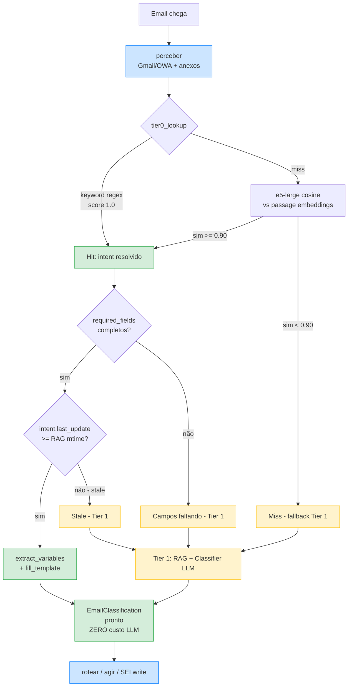

# Playbook de Procedimentos — Tier 0

> **Tier 0 da Memória Híbrida**: procedimentos repetitivos da Secretaria do
> Curso de Design Gráfico (UFPR) em formato estruturado, para roteamento com
> custo quase zero (sem RAG, sem LLM de classificação).
>
> **Fluxo:**
> 1. `tier0_lookup` faz match por keywords (regex) → score 1.0.
> 2. Miss → match semântico (e5-large, cosine > 0.90) contra `intent_name + keywords`.
> 3. Hit → preenche `template`, valida `required_fields`, finaliza.
> 4. Miss / `last_update` < mtime do RAG → fallback para Tier 1 (RAG + LLM).
>
> **Prioridade dos intents** (peso real medido em março/2026,
> `base_conhecimento/manual_sei.txt`):
>
> | Tipo de processo SEI | Qtde | Intents Tier 0 |
> |---|---|---|
> | Estágio Não Obrigatório | 238 | `estagio_nao_obrig_*` |
> | Informações e Documentos | 132 | (genérico → Tier 1) |
> | Registro de Diplomas | 62 | `diploma_*` |
> | Estágio Obrigatório | 60 | `estagio_obrig_*` |
> | Dispensa/Aproveitamento de Disciplinas | 60 | `aproveitamento_*` |
> | Voluntariado Acadêmico | 42 | `voluntariado_*` |
> | Matrículas | 30 | `matricula_*` |
> | Expedição de Diploma | 23 | `diploma_*` |
> | Trancamento/Destrancamento | 13 | `trancamento_*` |
> | Cancelamento por Abandono | 12 | `cancelamento_abandono` |
> | Cancelamento por Prazo | 11 | `cancelamento_prazo` |
> | Colação de Grau | 11+5+3 | `colacao_grau_*` |
>
> **Bases normativas chave**:
>
> - **Lei 11.788/2008** — Lei Federal de Estágios
> - **Resolução 46/10-CEPE** — Estágios na UFPR
> - **Resolução 70/04-CEPE** — Atividades Formativas
> - **Resolução 92/13-CEPE** (alterada pela **39/18-CEPE**) — Dispensa /
>   Isenção / Aproveitamento de disciplinas
> - **IN 01/16-PROGRAD** — Trancamento / Destrancamento de Curso
> - **IN 01/12-CEPE** — Estágios não obrigatórios externos
> - **IN 01/13-CEPE** — Estágios dentro da UFPR
>
> **Contatos institucionais (FichaDoCurso, mar/2026)**:
>
> - Secretaria DG: `design.grafico@ufpr.br` · (41) 3360-5360
> - COAPPE / Unidade de Estágios: `estagio@ufpr.br` · (41) 3310-2706
> - PROGEPE (estágios remunerados na UFPR): `progepe@ufpr.br`
> - Endereço Coordenação: Rua General Carneiro, 460, 8º andar, sala 801, Centro, Curitiba/PR
>
> **Placeholders**: `[NOME_CAMPO]` é preenchido pelo extractor.
> `{{ assinatura_email }}` vem de `settings.ASSINATURA_EMAIL`.
> Placeholders desconhecidos sobrevivem para revisão humana.
>
> **Manutenção**: ao alterar `template`, atualize `last_update` para a data
> corrente (YYYY-MM-DD). A staleness check usa esse campo para invalidar
> intents quando a base RAG é reingerida.

---

## Fluxo Tier 0 (diagrama)



> Diagrama do que `graph/builder.py:build_graph()` faz em runtime.
> Hits verdes = caminho Tier 0 (sem RAG, sem LLM classificador).
> Caminhos amarelos = fallback pra Tier 1 (custa RAG + LLM).

---

## §1. Estágio Não Obrigatório (238 processos — categoria mais comum)

```intent
intent_name: estagio_nao_obrig_acuse_inicial
keywords:
  - "TCE"
  - "Termo de Compromisso de Estágio"
  - "novo estágio"
  - "iniciar estágio"
  - "abrir estágio"
  - "encaminhar TCE"
  - "começar estágio"
  - "assinatura TCE"
categoria: "Estágios"
action: "Redigir Resposta"
sei_action: "create_process"
sei_process_type: "Graduação/Ensino Técnico: Estágios não Obrigatórios"
required_fields:
  - nome_aluno
  - grr
  - numero_tce
  - nome_concedente
  - data_inicio
  - data_fim
required_attachments:
  - "TCE"                 # Termo de Compromisso de Estágio assinado
                          # (o Plano de Atividades via de regra vem
                          #  embutido no mesmo PDF do TCE — não é anexo
                          #  separado no SEI)
blocking_checks:
  - "siga_matricula_ativa"              # HARD: trancada/cancelada/integralizada
  - "siga_reprovacoes_ultimo_semestre"  # SOFT: > 1 → exigir justificativa formal
  - "siga_reprovacao_por_falta"         # HARD: regra específica Design Gráfico
  - "siga_curriculo_integralizado"      # HARD: não pode estágio não-obrig. se já integralizou
  - "siga_ch_simultaneos_30h"           # HARD: soma de estágios > 30h/semana
  - "siga_concedente_duplicada"         # HARD: dois estágios simultâneos na mesma concedente
  - "data_inicio_retroativa"            # HARD: início < hoje
  - "data_inicio_antecedencia_minima"   # HARD: início - hoje < 2 dias úteis
  - "tce_jornada_sem_horario"           # HARD: TCE não especifica horário da jornada
  - "tce_jornada_antes_meio_dia"        # HARD (exceto se curriculo_integralizado): aulas de manhã
  - "sei_processo_vigente_duplicado"    # HARD: já existe processo VIGENTE do mesmo tipo para este aluno
sources:
  - "Lei 11.788/2008"
  - "Resolução 46/10-CEPE"
  - "IN 01/12-CEPE"
  - "Regulamento de Estágio do Curso de Design Gráfico (2024)"
  - "SOUL.md §7, §8.1, §11, §12, §14.1, §15.1"
  - "base_conhecimento/manual_sei.txt §Estágio Não Obrigatório"
last_update: "2026-04-10"
confidence: 0.90

# Email de acuse ao aluno — usado APÓS o processo SEI ter sido criado e
# o TCE + Despacho anexados, para que a variável [NUMERO_PROCESSO_SEI] seja
# preenchida com o número real do processo recém-criado.
template: |
  Prezado(a) [NOME_ALUNO],

  A Coordenação do Curso de Design Gráfico acusa o recebimento do Termo de
  Compromisso de Estágio nº [NUMERO_TCE] do(a) estudante [NOME_ALUNO], GRR
  [GRR], a ser realizado na [NOME_CONCEDENTE], no período de [DATA_INICIO]
  a [DATA_FIM].

  A documentação foi incluída no processo SEI nº [NUMERO_PROCESSO_SEI] e
  encaminhada à Unidade de Estágios da COAPPE/PROGRAP (estagio@ufpr.br) para
  verificação e autorização. Eventuais pendências serão comunicadas
  oportunamente.

  Informamos que o estágio somente poderá ter início após a autorização
  formal pela UE/COAPPE, conforme estabelece a Resolução 46/10-CEPE e o
  Regulamento de Estágio do Curso de Design Gráfico. Não é permitida
  homologação com data retroativa, motivo pelo qual o TCE deve chegar com
  pelo menos 2 dias úteis de antecedência ao início pretendido.

  Em caso de dúvidas, a COAPPE atende pelo telefone (41) 3310-2706.

  {{ assinatura_email }}

# Despacho SEI (SOUL.md §14.1) — incluído no processo junto com o TCE.
# Os campos [HORAS_DIARIAS] / [HORAS_SEMANAIS] / datas / nome da concedente
# são extraídos do texto do TCE anexado pelo ``extract_variables`` estendido.
despacho_template: |
  Prezados,

          A Coordenação do Curso de Design Gráfico acusa o recebimento do Termo de
  Compromisso de Estágio nº [NUMERO_TCE] (SEI [NUMERO_SEI_TCE]) e manifesta-se favorável
  à realização do Estágio Não Obrigatório do estudante [NOME_ALUNO_MAIUSCULAS],
  [GRR], na [NOME_CONCEDENTE_MAIUSCULAS], no período de [DATA_INICIO] a [DATA_FIM],
  com jornada de [HORAS_DIARIAS] horas diárias, totalizando [HORAS_SEMANAIS] horas
  semanais, sendo a jornada realizada de forma compatível com as atividades
  acadêmicas.

          Por este despacho, declaro também minha assinatura no referido documento, que
  corresponde tanto como professora orientadora do estágio quanto como coordenadora de
  curso, e informamos que ratifica-se integralmente o Termo de Compromisso de Estágio
  nº [NUMERO_TCE], anexo a este processo, para todos os fins legais.
```

```intent
intent_name: estagio_nao_obrig_aditivo
keywords:
  - "termo aditivo"
  - "aditivo de estágio"
  - "prorrogação de estágio"
  - "prorrogar estágio"
  - "aditivo TCE"
  - "alteração de TCE"
  - "nova vigência"
categoria: "Estágios"
action: "Redigir Resposta"
required_fields:
  - nome_aluno
sources:
  - "Resolução 46/10-CEPE"
  - "Lei 11.788/2008 Art. 11"
  - "SOUL.md §8.2"
last_update: "2026-04-09"
confidence: 0.88
template: |
  Prezado(a) [NOME_ALUNO],

  A Coordenação do Curso de Design Gráfico recebeu o Termo Aditivo nº
  [NUMERO_ADITIVO], referente ao seu estágio na [NOME_CONCEDENTE]
  (TCE nº [NUMERO_TCE]). O documento será incluído no processo SEI já
  existente e encaminhado à COAPPE com manifestação favorável da
  Coordenação.

  Após análise pela COAPPE, a nova data de término passará a ser
  [DATA_TERMINO], preservadas as demais condições do TCE original.
  Lembramos que:

  - O aditivo deve **obrigatoriamente** chegar antes da data de término
    do TCE atual — após o vencimento, o estágio encerra-se automaticamente
    e não é possível prorrogar retroativamente.
  - A duração total do mesmo estágio na mesma concedente não pode
    ultrapassar 24 meses (Art. 11 da Lei 11.788/2008).
  - Novo Relatório Parcial deverá ser apresentado em até 6 meses, ou
    Relatório Final na conclusão das atividades.

  {{ assinatura_email }}
```

```intent
intent_name: estagio_nao_obrig_conclusao
keywords:
  - "conclusão de estágio"
  - "rescisão de estágio"
  - "encerramento do estágio"
  - "relatório final de estágio"
  - "termo de rescisão"
  - "finalizar estágio"
categoria: "Estágios"
action: "Redigir Resposta"
required_fields:
  - nome_aluno
sources:
  - "Resolução 46/10-CEPE"
  - "SOUL.md §8.3"
  - "SOUL.md §15.4"
last_update: "2026-04-09"
confidence: 0.88
template: |
  Prezado(a) [NOME_ALUNO],

  A Coordenação do Curso confirma o recebimento do Relatório Final de
  Estágio e do Termo de Rescisão/Conclusão referentes ao seu estágio na
  [NOME_CONCEDENTE]. Os documentos serão incluídos no processo SEI
  existente e encaminhados à COAPPE para homologação.

  Após a homologação:

  - **Estágio não obrigatório**: o certificado será emitido pela COAPPE em
    até 5 dias úteis e encaminhado por e-mail.
  - **Estágio obrigatório**: o lançamento de nota e frequência na
    disciplina de Estágio Supervisionado será realizado pela coordenação
    após a avaliação final pelo professor orientador.

  Em caso de dúvidas sobre a homologação, a COAPPE atende pelo
  e-mail estagio@ufpr.br ou telefone (41) 3310-2706.

  {{ assinatura_email }}
```

```intent
intent_name: estagio_nao_obrig_pendencia
keywords:
  - "pendência de documentação"
  - "documentação incompleta"
  - "assinatura faltando"
  - "plano de atividades não anexado"
  - "corrigir TCE"
  - "documento incompleto"
categoria: "Estágios"
action: "Redigir Resposta"
required_fields:
  - nome_aluno
sources:
  - "Resolução 46/10-CEPE"
  - "SOUL.md §15.5"
last_update: "2026-04-09"
confidence: 0.82
template: |
  Prezado(a) [NOME_ALUNO],

  Em análise à documentação referente ao seu estágio na [NOME_CONCEDENTE],
  identificamos a(s) seguinte(s) pendência(s):

  [LISTAR_PENDENCIAS]

  Solicitamos a regularização e o reenvio da documentação completa para
  que possamos dar prosseguimento ao processo. Enquanto a documentação
  estiver pendente, o estágio não poderá ser autorizado.

  Em caso de dúvidas, entre em contato com a Coordenação ou diretamente
  com a COAPPE pelo e-mail estagio@ufpr.br ou telefone (41) 3310-2706.

  {{ assinatura_email }}
```

---

## §2. Estágio Obrigatório (60 processos)

```intent
intent_name: estagio_obrig_matricula
keywords:
  - "estágio obrigatório matrícula"
  - "matricular em estágio supervisionado"
  - "disciplina de estágio supervisionado"
  - "Estágio Supervisionado"
  - "estágio curricular obrigatório"
categoria: "Estágios"
action: "Redigir Resposta"
required_fields:
  - nome_aluno
sources:
  - "Lei 11.788/2008"
  - "Resolução 46/10-CEPE"
  - "Regulamento de Estágio do Curso de Design Gráfico (2024)"
  - "PPC Design Gráfico — Currículos 2016 e 2020"
  - "manual_sei.txt §Estágio Obrigatório"
last_update: "2026-04-09"
confidence: 0.85
template: |
  Prezado(a) [NOME_ALUNO],

  Sobre o Estágio Supervisionado (estágio obrigatório), informamos:

  - É uma disciplina do PPC, com carga horária de **360 horas** prevista no
    4º ano. A matrícula é feita via SIGA no período regular.
  - Pré-requisitos de carga horária integralizada:
    - **Currículo 2020**: 1.035 horas (855h obrigatórias + 180h optativas).
    - **Currículo 2016**: 1.440 horas integralizadas.
  - Avaliação: defesa oral + relatório, nota mínima 50/100.
  - Frequência mínima: 75% da carga horária.
  - Não emite certificado para alunos da UFPR; o seguro é pago pela UFPR.
  - Estágios obrigatórios em órgãos públicos não podem ser remunerados
    (Orientação Normativa 02/2016-MPOG).

  O processo no SEI é aberto pela Coordenação no tipo "Graduação/Ensino
  Técnico: Estágio Obrigatório" e contém: comprovante de matrícula na
  disciplina, TCE, relatórios e avaliação final do supervisor.

  Confirme em qual currículo está vinculado(a) e se já cumpriu os
  pré-requisitos de carga horária para que possamos orientar os próximos
  passos.

  {{ assinatura_email }}
```

---

## §3. Dispensa / Aproveitamento de Disciplinas (60 processos)

```intent
intent_name: aproveitamento_disciplinas
keywords:
  - "aproveitamento de disciplina"
  - "aproveitamento de estudos"
  - "dispensa de disciplina"
  - "dispensar disciplina"
  - "isenção de disciplina"
  - "validar disciplina cursada"
categoria: "Acadêmico / Aproveitamento de Disciplinas"
action: "Redigir Resposta"
required_fields:
  - nome_aluno
sources:
  - "Resolução 92/13-CEPE (alterada pela Resolução 39/18-CEPE)"
  - "manual_sei.txt §Dispensa/Isenção/Aproveitamento de disciplinas"
last_update: "2026-04-09"
confidence: 0.87
template: |
  Prezado(a) [NOME_ALUNO],

  Sobre o pedido de aproveitamento (dispensa/isenção) de disciplinas,
  informamos o procedimento padrão adotado pela Coordenação do Curso de
  Design Gráfico, conforme a **Resolução 92/13-CEPE** (alterada pela
  **Resolução 39/18-CEPE**):

  1. Abertura de requerimento via SIGA, juntando:
     - Histórico escolar oficial da instituição de origem (autenticado);
     - Ementa e programa completos da(s) disciplina(s) já cursada(s),
       com carga horária e bibliografia;
     - Plano de aulas, quando disponível.
  2. A Coordenação abrirá um processo SEI individual do tipo
     "Graduação/Ensino Técnico: Dispensa/Isenção/Aproveitamento de
     disciplinas".
  3. Análise pelo professor responsável pela disciplina equivalente na
     UFPR, que emite parecer sobre compatibilidade de conteúdo e carga
     horária.
  4. Homologação pelo Colegiado do Curso e registro no SIGA.

  A dispensa é concedida quando há compatibilidade mínima de conteúdo
  programático e carga horária, conforme análise do(a) docente
  responsável. Por favor, confirme que possui a documentação acima e
  encaminhe a solicitação pelo SIGA para que possamos abrir o processo.

  {{ assinatura_email }}
```

```intent
intent_name: equivalencia_disciplinas
keywords:
  - "equivalência de disciplina"
  - "equivalência de disciplinas"
  - "disciplina cursada em outra universidade"
  - "disciplina de outra IES"
  - "transferência de disciplina"
categoria: "Acadêmico / Equivalência de Disciplinas"
action: "Redigir Resposta"
required_fields:
  - nome_aluno
sources:
  - "Resolução 92/13-CEPE (alterada pela 39/18-CEPE)"
  - "manual_siga.txt §5.2 Equivalências"
last_update: "2026-04-09"
confidence: 0.85
template: |
  Prezado(a) [NOME_ALUNO],

  Sobre o pedido de **equivalência** de disciplinas, informamos:

  - A análise de equivalência de disciplinas cursadas em outras IES é
    feita pelo Colegiado do Curso de Design Gráfico, com base na
    Resolução 92/13-CEPE (alterada pela 39/18-CEPE).
  - O pedido é registrado pelo aluno no SIGA, em
    "Equivalências de disciplinas", e a Coordenação acompanha o trâmite
    em /siga/graduacao/equivalencias.
  - Documentação necessária: histórico oficial da IES de origem,
    ementa/programa da disciplina cursada (com carga horária e
    bibliografia) e, quando aplicável, declaração de aprovação.
  - Após o lançamento no SIGA, a Coordenação encaminha ao(s)
    professor(es) responsável(eis) pela disciplina equivalente para
    parecer e, em seguida, ao Colegiado para homologação.

  Confirme se já abriu a solicitação no SIGA e, em caso negativo, faça-o
  para que possamos dar andamento.

  {{ assinatura_email }}
```

```intent
intent_name: ajuste_disciplinas_quebra_barreira
keywords:
  - "quebra de barreira"
  - "quebrar barreira"
  - "dispensa de pré-requisito"
  - "cursar sem pré-requisito"
  - "adiantar disciplina"
  - "antecipar disciplina"
categoria: "Acadêmico / Ajuste de Disciplinas"
action: "Redigir Resposta"
required_fields:
  - nome_aluno
sources:
  - "PPC do Curso de Design Gráfico"
  - "Resolução 92/13-CEPE"
last_update: "2026-04-09"
confidence: 0.85
template: |
  Prezado(a) [NOME_ALUNO],

  Sobre o pedido de **quebra de barreira** (dispensa de pré-requisito),
  informamos que a análise é feita caso a caso pelo Colegiado do Curso de
  Design Gráfico, considerando:

  - Justificativa acadêmica do(a) estudante;
  - Parecer do(a) professor(a) responsável pela disciplina pretendida;
  - Impacto no fluxo curricular e no tempo de integralização;
  - Aderência ao PPC do curso (Currículo 2016 ou 2020, conforme o seu
    caso).

  Para solicitar, encaminhe via SIGA (Requerimento ao Colegiado) a
  justificativa escrita indicando:

  1. A disciplina pretendida e o(s) pré-requisito(s) a dispensar;
  2. O motivo acadêmico (ex.: disciplina equivalente cursada,
     conhecimento prévio comprovado, necessidade para ajuste de fluxo);
  3. Confirmação de que já discutiu a pretensão com o(a) professor(a) da
     disciplina.

  A deliberação do Colegiado será comunicada via SIGA. Ressaltamos que a
  quebra de barreira é excepcional e não constitui direito adquirido.

  {{ assinatura_email }}
```

---

## §4. Voluntariado Acadêmico (42 processos — frequente como AFC)

```intent
intent_name: voluntariado_academico
keywords:
  - "voluntariado acadêmico"
  - "programa de voluntariado"
  - "voluntário acadêmico"
  - "PVA"
  - "horas de voluntariado"
categoria: "Formativas"
action: "Redigir Resposta"
required_fields:
  - nome_aluno
sources:
  - "Resolução 70/04-CEPE (Atividades Formativas)"
  - "manual_sei.txt §Voluntariado Acadêmico (42 processos)"
last_update: "2026-04-09"
confidence: 0.85
template: |
  Prezado(a) [NOME_ALUNO],

  Sobre o **Programa de Voluntariado Acadêmico (PVA)**, informamos:

  - É uma forma reconhecida de cumprir horas de **Atividades Formativas
    Complementares (AFC)** do Curso de Design Gráfico, conforme a
    Resolução 70/04-CEPE.
  - A participação deve estar vinculada a um projeto institucional da
    UFPR (pesquisa, ensino ou extensão) com orientador docente
    responsável.
  - O processo no SEI é aberto pela Coordenação no tipo "Graduação:
    Programa de Voluntariado Acadêmico", instruído com:
    - Plano de trabalho assinado pelo orientador;
    - Cronograma e carga horária prevista;
    - Termo de adesão do estudante.
  - Ao final do período, o orientador emite relatório com a frequência e
    a carga horária cumprida, que é registrada como AFC no SIGA.

  Para detalhes sobre AFC do Curso de Design Gráfico, consulte:
  https://sacod.ufpr.br/coordesign/atividades-formativas-complementares-dg/

  Confirme se já tem orientador e plano de trabalho definidos para que
  possamos abrir o processo.

  {{ assinatura_email }}
```

---

## §5. Trancamento e Destrancamento de Curso (13 processos)

```intent
intent_name: trancamento_curso_primeiro
keywords:
  - "trancar o curso"
  - "trancamento de curso"
  - "primeiro trancamento"
  - "trancar matrícula curso"
  - "trancar curso este semestre"
  - "interromper o curso"
  - "pausar o curso"
categoria: "Acadêmico / Matrícula"
action: "Redigir Resposta"
required_fields:
  - nome_aluno
sources:
  - "Instrução Normativa 01/16-PROGRAD"
  - "manual_sei.txt §Trancamento/Destrancamento"
  - "manual_siga.txt §2.3 Trancamentos de Curso"
last_update: "2026-04-09"
confidence: 0.86
template: |
  Prezado(a) [NOME_ALUNO],

  Sobre o **trancamento de curso**, informamos o procedimento conforme a
  **Instrução Normativa 01/16-PROGRAD**:

  - O **1º trancamento** é **imotivado** — basta abrir o requerimento via
    SIGA dentro do prazo definido pelo calendário acadêmico vigente.
  - Os **2º e 3º trancamentos** exigem justificativa escrita e
    documentação comprobatória (ex.: atestado médico, comprovante de
    intercâmbio, declaração de trabalho), submetida ao Colegiado do
    Curso para análise.
  - Após o requerimento, a Coordenação abrirá um processo SEI do tipo
    "Graduação: Solicitação de Trancamento de Curso" e dará andamento.

  Atenção:

  - Eventual **estágio vigente será cancelado automaticamente**
    (Lei 11.788/2008), pois exige matrícula regular.
  - **Bolsas** (IC, extensão, PET, monitoria) podem ser interrompidas —
    consulte o setor responsável antes de tramitar o pedido.
  - Verifique no SIGA o **prazo máximo de integralização** do seu
    currículo, pois trancamentos contam para esse limite.

  Caso deseje prosseguir, abra o requerimento no SIGA e nos avise por
  e-mail para que possamos abrir o processo SEI correspondente.

  {{ assinatura_email }}
```

```intent
intent_name: destrancamento_curso
keywords:
  - "destrancamento"
  - "destrancar"
  - "voltar do trancamento"
  - "reativar matrícula"
  - "retornar ao curso"
categoria: "Acadêmico / Matrícula"
action: "Redigir Resposta"
required_fields:
  - nome_aluno
sources:
  - "Instrução Normativa 01/16-PROGRAD"
  - "manual_sei.txt §Trancamento/Destrancamento"
last_update: "2026-04-09"
confidence: 0.85
template: |
  Prezado(a) [NOME_ALUNO],

  Sobre o **destrancamento de curso**, informamos:

  - O retorno deve ser solicitado via SIGA dentro do **prazo previsto no
    calendário acadêmico** para o semestre em que se pretende retornar.
  - É responsabilidade do(a) estudante realizar a **rematrícula** no
    período regular após o destrancamento — sem ela o registro pode ser
    encaminhado para cancelamento por abandono.
  - A Coordenação acompanha o trâmite no processo SEI "Graduação:
    Solicitação de Destrancamento de Curso" e em
    https://siga.ufpr.br/siga/graduacao/trancamentos.jsp

  Confirme em qual semestre pretende retornar para que possamos verificar
  os prazos do calendário acadêmico vigente.

  {{ assinatura_email }}
```

---

## §6. Cancelamento de Registro (11+12 processos)

```intent
intent_name: cancelamento_abandono
keywords:
  - "cancelamento por abandono"
  - "abandono de curso"
  - "perdi a matrícula por abandono"
  - "registro cancelado abandono"
  - "dois semestres sem matricular"
categoria: "Acadêmico / Matrícula"
action: "Redigir Resposta"
required_fields:
  - nome_aluno
sources:
  - "manual_sei.txt §Cancelamento por Abandono de Curso"
  - "Instrução Normativa 01/16-PROGRAD"
last_update: "2026-04-09"
confidence: 0.83
template: |
  Prezado(a) [NOME_ALUNO],

  Sobre o **cancelamento por abandono de curso**, informamos:

  - O cancelamento por abandono é **iniciado pela Coordenação** quando o
    estudante deixa de realizar matrícula por **dois semestres
    consecutivos** sem trancamento formal.
  - O processo é instruído no SEI no tipo "Graduação: Cancelamento por
    Abandono de Curso", com a análise do histórico e do registro de
    matrículas no SIGA.
  - Antes da efetivação, a Coordenação envia comunicação ao(à)
    estudante. Se houver justificativa formal e documentação que
    comprove a impossibilidade de matrícula, o caso pode ser revisto
    pelo Colegiado.

  Caso já tenha recebido o aviso de cancelamento e queira contestar,
  responda este e-mail anexando:

  1. Justificativa por escrito com os motivos da ausência de matrícula;
  2. Documentação comprobatória (atestado, comprovante de viagem,
     contrato de trabalho, etc.);
  3. Indicação de quando pretende retomar os estudos.

  A Coordenação levará o caso ao Colegiado para deliberação.

  {{ assinatura_email }}
```

```intent
intent_name: cancelamento_prazo_integralizacao
keywords:
  - "cancelamento por prazo"
  - "ultrapassar prazo de integralização"
  - "prazo máximo do curso"
  - "tempo máximo para formar"
  - "integralização vencida"
categoria: "Acadêmico / Matrícula"
action: "Redigir Resposta"
required_fields:
  - nome_aluno
sources:
  - "manual_sei.txt §Cancelamento de Registro Acadêmico"
  - "Regimento Geral da UFPR"
last_update: "2026-04-09"
confidence: 0.83
template: |
  Prezado(a) [NOME_ALUNO],

  Sobre o **cancelamento por prazo de integralização**, informamos:

  - O Regimento Geral da UFPR estabelece um **prazo máximo de
    integralização curricular**. Estudantes que ultrapassam esse limite
    têm seu registro acadêmico cancelado, conforme o tipo SEI
    "Graduação: Cancelamento de Registro Acadêmico (ultrapassar prazo
    de integralização)".
  - O prazo é contado desde o ingresso e considera trancamentos e
    período máximo previsto no calendário do curso.
  - Antes da efetivação, a Coordenação verifica a aba **Integralização**
    no SIGA e encaminha o caso ao Colegiado para parecer.
  - Há possibilidade de **prorrogação de prazo para conclusão do curso**
    (tipo SEI próprio), desde que solicitada **antes** do vencimento e
    com justificativa fundamentada.

  Se está nessa situação, encaminhe à Coordenação:

  1. Pedido formal de prorrogação de prazo (se ainda dentro do prazo);
  2. Justificativa acadêmica com as disciplinas que faltam;
  3. Cronograma de conclusão proposto.

  {{ assinatura_email }}
```

---

## §7. Colação de Grau (11+5+3 processos)

```intent
intent_name: colacao_grau_solenidade
keywords:
  - "colação de grau com solenidade"
  - "cerimônia de colação"
  - "data da colação"
  - "convite para colação"
  - "colação oficial"
categoria: "Diplomação / Colação de Grau"
action: "Redigir Resposta"
required_fields:
  - nome_aluno
sources:
  - "manual_sei.txt §Colação de Grau com Solenidade"
  - "manual_siga.txt §5.4 Colações de Grau"
last_update: "2026-04-09"
confidence: 0.86
template: |
  Prezado(a) [NOME_ALUNO],

  Sobre a **colação de grau com solenidade**, informamos:

  - As colações são organizadas pela PROGRAP, com calendário disponível
    no SIGA em /siga/graduacao/colacoes?op=listar.
  - Para participar é necessário estar com a integralização completa
    confirmada (aba "Integralização" no SIGA com status "Integralizado")
    e sem débitos no SIBI (biblioteca).
  - A Coordenação abre um processo SEI "Graduação: Colação de Grau com
    Solenidade" para cada formando, contendo histórico final e
    confirmação de quitação SIBI.
  - Após a colação, a ATA é assinada pela Coordenação e o processo é
    encaminhado para a expedição de diploma.

  Por favor, confirme:

  1. Em qual semestre/data você pretende colar grau;
  2. Se já verificou a aba **Integralização** no SIGA;
  3. Se já está quite com o SIBI (biblioteca).

  Em caso de dúvidas sobre datas e cerimônias, consulte o calendário no
  SIGA ou aguarde o e-mail oficial da PROGRAP.

  {{ assinatura_email }}
```

```intent
intent_name: colacao_grau_sem_solenidade
keywords:
  - "colação em gabinete"
  - "colação sem solenidade"
  - "antecipação de colação"
  - "colar grau antecipado"
  - "colação extraordinária"
categoria: "Diplomação / Colação de Grau"
action: "Redigir Resposta"
required_fields:
  - nome_aluno
sources:
  - "manual_sei.txt §Colação de Grau sem Solenidade / Antecipação"
last_update: "2026-04-09"
confidence: 0.84
template: |
  Prezado(a) [NOME_ALUNO],

  Sobre a **colação de grau sem solenidade** (em gabinete) ou
  **antecipação de colação**, informamos:

  - A modalidade é admitida em casos justificados (ex.: posse em concurso,
    ingresso em pós-graduação com início imediato, motivos de saúde,
    viagem de mobilidade) e exige requerimento formal.
  - É necessário estar com a **integralização completa** e sem débitos
    no SIBI.
  - O processo no SEI é aberto pela Coordenação no tipo "Graduação:
    Colação de Grau sem Solenidade" ou "Graduação: Colação de Grau /
    Antecipação", instruído com:
    - Requerimento do(a) estudante;
    - Justificativa documentada (carta de admissão, edital de
      nomeação, atestado, etc.);
    - Histórico final;
    - Comprovante de quitação SIBI.

  Encaminhe a documentação à Coordenação para que possamos abrir o
  processo. Após análise pela PROGRAP, será marcada uma data específica
  para a cerimônia em gabinete.

  {{ assinatura_email }}
```

---

## §8. Diploma (62 + 23 processos — registro + expedição)

```intent
intent_name: diploma_registro_expedicao
keywords:
  - "registro de diploma"
  - "expedição de diploma"
  - "retirar diploma"
  - "segunda via de diploma"
  - "diploma pronto"
  - "quando sai meu diploma"
categoria: "Diplomação / Diploma"
action: "Redigir Resposta"
required_fields:
  - nome_aluno
sources:
  - "manual_sei.txt §Registro de Diplomas (62) + Expedição (23)"
last_update: "2026-04-09"
confidence: 0.85
template: |
  Prezado(a) [NOME_ALUNO],

  Sobre o **registro e expedição de diploma**, informamos:

  - Após a colação de grau, a Coordenação abre o processo SEI
    "Graduação: Registro de Diplomas" e o encaminha à PROGRAP.
  - A PROGRAP é responsável pela conferência do histórico, registro
    formal e emissão do documento.
  - A expedição é registrada em processo SEI próprio
    ("Graduação/Ensino Técnico: Expedição de Diploma").
  - O prazo médio de emissão e disponibilização varia conforme o fluxo
    da PROGRAP — não há prazo fixo definido pela Coordenação do Curso.
  - O acompanhamento pode ser feito diretamente com a PROGRAP, ou
    informe o número do processo SEI para que possamos verificar.

  Para 2ª via, é necessário abrir requerimento específico junto à
  PROGRAP com justificativa e documentação (boletim de ocorrência em
  caso de extravio).

  {{ assinatura_email }}
```

---

## §9. Matrícula (30 processos)

```intent
intent_name: matricula_situacao_especial
keywords:
  - "matrícula especial"
  - "matrícula fora do prazo"
  - "matrícula em mobilidade"
  - "matrícula PROVAR"
  - "matrícula intercâmbio"
  - "ajuste de matrícula"
categoria: "Acadêmico / Matrícula"
action: "Redigir Resposta"
required_fields:
  - nome_aluno
sources:
  - "manual_sei.txt §Matrículas / Matrícula em curso"
  - "manual_siga.txt §2.2 Gerenciar Matrículas"
last_update: "2026-04-09"
confidence: 0.80
template: |
  Prezado(a) [NOME_ALUNO],

  Sobre o seu pedido de **matrícula em situação especial**, informamos:

  - O SIGA é o canal regular para matrícula no período definido pelo
    calendário acadêmico. Situações especiais (mobilidade, intercâmbio,
    estrangeiros, PROVAR, ajustes excepcionais) são tramitadas por
    processo SEI do tipo "Graduação: Matrículas".
  - Para que possamos analisar o seu caso, encaminhe nesta resposta:

    1. GRR (matrícula) e currículo (2016 ou 2020);
    2. Descrição da situação (mobilidade, transferência, ajuste fora do
       prazo, etc.);
    3. Documentação que justifica o pedido;
    4. Disciplina(s) e turma(s) pretendidas, quando aplicável.

  A Coordenação verificará a viabilidade junto ao SIGA e à PROGRAP e
  encaminhará a resposta com os próximos passos.

  {{ assinatura_email }}
```

---

## §10. FAQs de Estágio (alta frequência, resposta canônica)

```intent
intent_name: faq_estagio_duracao_maxima
keywords:
  - "quanto tempo no mesmo estágio"
  - "duração máxima do estágio"
  - "tempo máximo de estágio"
  - "estágio mais de 2 anos"
  - "prorrogação após 24 meses"
categoria: "Estágios"
action: "Redigir Resposta"
required_fields:
  - nome_aluno
sources:
  - "Art. 11 da Lei 11.788/2008"
last_update: "2026-04-09"
confidence: 0.95
template: |
  Prezado(a) [NOME_ALUNO],

  A duração máxima permitida para um mesmo estágio é de **24 meses
  (2 anos)** na mesma parte concedente, conforme o **Art. 11 da Lei
  11.788/2008**. O limite vale tanto para estágio obrigatório quanto
  para o não obrigatório, com exceção prevista em lei apenas para
  estagiários com deficiência.

  Após esse prazo, não é possível prorrogar o mesmo TCE. O(a) estudante
  pode iniciar um novo estágio em outra concedente, observadas as demais
  regras do Regulamento de Estágio do Curso de Design Gráfico.

  {{ assinatura_email }}
```

```intent
intent_name: faq_estagio_prorrogar
keywords:
  - "posso prorrogar meu estágio"
  - "como prorrogar estágio"
  - "renovar estágio"
  - "estender meu estágio"
categoria: "Estágios"
action: "Redigir Resposta"
required_fields:
  - nome_aluno
sources:
  - "Resolução 46/10-CEPE"
  - "Lei 11.788/2008 Art. 11"
last_update: "2026-04-09"
confidence: 0.95
template: |
  Prezado(a) [NOME_ALUNO],

  Sim, é possível prorrogar o seu estágio por meio de **Termo Aditivo**,
  desde que a solicitação ocorra **antes** da data de término do TCE
  atual e que a duração total não ultrapasse 24 meses na mesma
  concedente (Art. 11 da Lei 11.788/2008).

  Após o vencimento do TCE, o estágio encerra-se automaticamente e não
  é possível prorrogar retroativamente — nesse caso, seria necessário
  firmar um novo TCE com a concedente.

  Para solicitar o aditivo, preencha o formulário disponível no site da
  COAPPE, colete as assinaturas (concedente, supervisor, orientador) e
  encaminhe à Coordenação antes da data de término do TCE original. Em
  caso de dúvidas, a COAPPE atende em estagio@ufpr.br ou
  (41) 3310-2706.

  {{ assinatura_email }}
```

```intent
intent_name: faq_estagio_trancamento_matricula
keywords:
  - "trancar matrícula e estágio"
  - "trancamento e estágio"
  - "estágio com matrícula trancada"
  - "manter estágio com trancamento"
categoria: "Estágios"
action: "Redigir Resposta"
required_fields:
  - nome_aluno
sources:
  - "Lei 11.788/2008"
  - "Resolução 46/10-CEPE"
last_update: "2026-04-09"
confidence: 0.94
template: |
  Prezado(a) [NOME_ALUNO],

  Informamos que, ao **trancar a matrícula**, o estágio é
  **cancelado automaticamente**. Apenas estudantes com matrícula
  regular podem manter vínculo de estágio ativo, conforme as regras de
  validação do Regulamento de Estágio e a Lei 11.788/2008.

  Caso efetive o trancamento, comunique imediatamente a Coordenação do
  Curso e a COAPPE (estagio@ufpr.br) para que o processo de rescisão
  seja providenciado junto à concedente.

  {{ assinatura_email }}
```

```intent
intent_name: faq_estagio_pos_formatura
keywords:
  - "continuar estagiando depois de formar"
  - "estágio após formatura"
  - "estagiar após integralizar"
  - "estagiar depois de formado"
categoria: "Estágios"
action: "Redigir Resposta"
required_fields:
  - nome_aluno
sources:
  - "Lei 11.788/2008"
  - "Resolução 46/10-CEPE"
last_update: "2026-04-09"
confidence: 0.95
template: |
  Prezado(a) [NOME_ALUNO],

  Informamos que **não é permitido** estagiar após a integralização do
  currículo. O estágio deve ser rescindido **antes** do final do último
  semestre letivo. Continuar estagiando após a conclusão do curso
  configura fraude de estágio, uma vez que o vínculo depende de
  matrícula ativa.

  Recomendamos providenciar o Termo de Rescisão junto à concedente com
  antecedência, para que o encerramento seja homologado pela COAPPE
  antes da colação de grau.

  {{ assinatura_email }}
```

```intent
intent_name: faq_estagio_orgao_publico_remunerado
keywords:
  - "estágio obrigatório remunerado"
  - "bolsa em órgão público"
  - "estágio obrigatório com bolsa"
  - "estágio remunerado na prefeitura"
categoria: "Estágios"
action: "Redigir Resposta"
required_fields:
  - nome_aluno
sources:
  - "Orientação Normativa 02/2016-MPOG"
  - "Decreto 8.654/2010 (PR)"
last_update: "2026-04-09"
confidence: 0.94
template: |
  Prezado(a) [NOME_ALUNO],

  Informamos que estágios **obrigatórios em órgãos públicos não podem
  ser remunerados**, conforme a Orientação Normativa 02/2016 (MPOG) e
  o Decreto Estadual 8.654/2010 (Paraná).

  Estágios **não obrigatórios** em órgãos públicos, quando previstos
  em edital específico com bolsa-auxílio, são permitidos. Para verificar
  a modalidade aplicável, consulte o edital da concedente ou entre em
  contato com a COAPPE (estagio@ufpr.br).

  {{ assinatura_email }}
```

```intent
intent_name: faq_ic_substitui_estagio_obrigatorio
keywords:
  - "iniciação científica substitui estágio"
  - "IC no lugar do estágio"
  - "substituir estágio por IC"
  - "iniciação científica como estágio"
categoria: "Estágios"
action: "Redigir Resposta"
required_fields:
  - nome_aluno
sources:
  - "PPC do Curso de Design Gráfico"
  - "Resolução 46/10-CEPE"
last_update: "2026-04-09"
confidence: 0.92
template: |
  Prezado(a) [NOME_ALUNO],

  Sim, a **Iniciação Científica** pode substituir o **Estágio
  Obrigatório**, desde que prevista no PPC do Curso e aprovada pela COE
  (Comissão Orientadora de Estágio). A solicitação é feita diretamente à
  Coordenação do Curso, sem necessidade de documentação na COAPPE.

  Recomenda-se que o(a) orientador(a) da IC **não seja** o(a) mesmo(a)
  professor(a) responsável pela disciplina de Estágio Supervisionado,
  para preservar a independência da avaliação.

  Para formalizar a substituição, encaminhe à Coordenação:

  1. Plano de trabalho da IC assinado pelo orientador;
  2. Declaração de regularidade no programa de IC;
  3. Manifestação favorável do orientador à substituição.

  {{ assinatura_email }}
```

---

## §11. Triagem de Ruído

```intent
intent_name: correio_lixo_spam_generico
keywords:
  - "promoção imperdível"
  - "desconto exclusivo"
  - "oferta por tempo limitado"
  - "clique aqui para ganhar"
  - "newsletter marketing"
  - "ganhe agora"
categoria: "Correio Lixo"
action: "Arquivar"
required_fields: []
sources: []
last_update: "2026-04-09"
confidence: 0.98
template: ""
```
